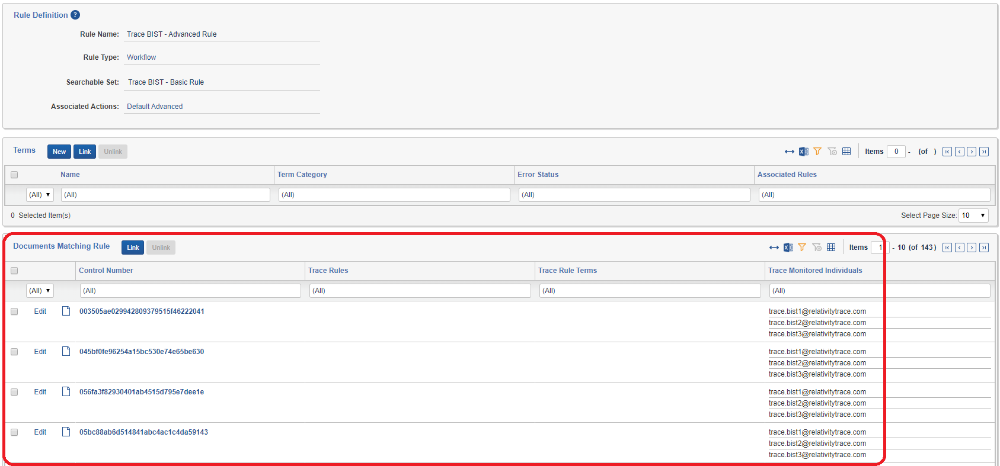

# Alert Rules
{: .no_toc }

Alert Rules are used to define the policies that identify misconduct within an organization.
{: .fs-6 .fw-300 }

1. TOC
{:toc}

---

## Overview

Alert Rules allow users to define the criteria of a document that should be alerted on. These Rules are executed on periodic basis at pre-configured intervals, allowing users to automatically and continously categorize and tag documents as they are ingested into the workspace.

There are both `Alert` Rules and `Workflow` Rules. This page focuses on Alert Rules. For information on Workflow Rules go to the [Workflow Rules]({{ site.baseurl }}) page.
{: .info }

## 1 - Creating a Rule

Create a new [rule](#_Glossary) by clicking `New Rule` on the `Trace`:`Rules` tab

The Rule Creation form contains the following fields:

-   **Rule Name:** the name of the rule

- **Rule Type:** classification of the purpose of the rule

  -   **Alert:** a rule that is designed to alert on responsive documents. Documents matching rules of this type are tagged in the Trace Rules field.
  -   **Workflow:** a rule that is designed to operate on every document in the workspace and take some action (run a script, move to the correct folder, etc) but not to alert on responsive documents. Documents matching rules of this type are tagged in the Trace Workflow Rules field.

-   **Searchable Set:** the document set searched when the Rule runs. Make sure this set contains all documents that should be considered by Trace Rules.
    
-   **Associated Actions:** actions are what happen when a rule matches a document. Currently supported Action Types are:
    -   **Data Disposal**: triggers deletion of specified documents after the configured retention policy
-   **Advanced:** execute customer provided Relativity Script
    -   **Email:** generates an email with metadata about alerted documents
    -   **Webhook:** makes a generic API call hosted within Relativity
    -   **Slack:** generates a Slack message with metadata about alerted documents
    -   **Move To Folder:** Move matched documents to a specific folder

Documents are always tagged automatically with the associated Rule (happens as the final action as part of Rule Evaluation, if a document is tagged then all of the actions on the rule were executed) on either the Trace Rules or Trace Workflow Rules field, depending on the Rule Type
{: .info }

Default actions shipped with Trace out of the box are meant as examples and are subject to being updated during application upgrades. In order to configure your rules please create a new action of specific type (you can also copy default actions as a starting point).
{: .info }

## 2 - Customizing and Running a Rule

After you create a Rule, use the Rule definition page to associate Terms and Enable/Disable the rule.

### Terms

Associating Terms with a Rule causes it to only target documents that contain one or more of the associated terms in their extracted text. To associate Terms with a Rule, use the New or Link buttons on the Rule Layout. Please see the Terms section below for more information on creating Terms.

### Enable / Disable

Clicking the Enable Rule console button on the right of the layout causes the Trace Manager Agent to run the rule on an ongoing basis. Clicking Disable Rule will stop future execution of the Rule.

A Rule will only execute when it is enabled. If a Rule is disabled while running, it will still finish its current execution.
{: .info }

## 3 - Validating Results

After Rule executes, documents matching the Rule will be associated to the Rule itself.

### Terms

In addition to metadata conditions of a Saved Search associated with Rule, you can apply extensive searching criteria to isolate only the most relevant documents.

#### Creating Terms

You can create Terms in multiple ways:

1.  Via [Remote Desktop Client ( RDC )](https://help.relativity.com/9.6/Content/Relativity/Relativity_Desktop_Client/Relativity_Desktop_Client.htm) load file. This method is ideal if you are adding a lot of terms at once.
    
2.  From Terms tab by clicking “New Term” and adding each Term individually.

3.  By clicking the New button on the Terms section of the Rule Layout.

Term definition contains 3 fields:

-   **Term:** searching string (unique identifier)
-   **Term Category:** optional group name to organize terms
-   **Score:** optional field to populate term weight to indicate importance
-   **Relativity highlight color:** optional highlighting configuration in the
    Relativity viewer (see [highlighting](#highlighting) section)

In addition, you can see and modify Term Categories and Rules associated with Term and its status with regards to execution

The Term “Name” (actual text being searched) **cannot** be modified after it is created. You must remove and add a new term object to change the search string. You **can** modify the highlight color and term category of an existing term.
{: .info }

The Term “Name” (actual text being searched) is limited to 450 characters. Please reach out `support@relativity.com` if your use-case requires higher limits for your terms.
{: .info }

## Highlighting

By default, Trace creates a `Trace Rules Persistent Highlight Set` that highlights Trace Terms currently associated with any Rule. If you would like to highlight Trace Terms that are not associated with any Rule, you create additional Persistent Highlight Set as needed.

In addition, you can override default highlight color scheme (magenta background and black text) for a specific Trace Term by specifying a semi-colon separated list of pre-configured color combinations. The details of the color codes can be accessed via Context Help button on the Term Definition page.

