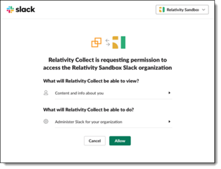
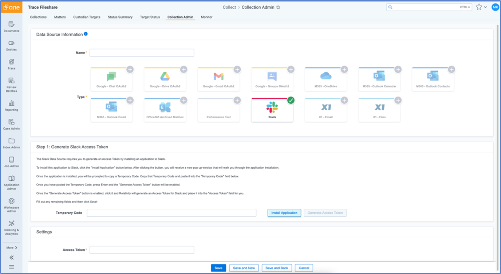
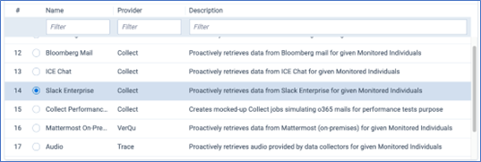
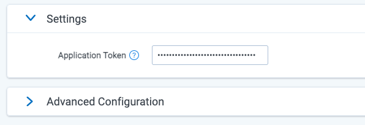

# Slack Enterprise Chat
{: .no_toc }

This topic provides details on how to capture Slack Enterprise chat messages via Collect.
{: .fs-6 .fw-300 }

1. TOC
{:toc}

---

## Requirements 

Before using this data source, note the following license requirements, version support, and special considerations.

### License requirements

The following licenses are required to use this data source:

- Slack Enterprise license is needed (due to required access to Discovery API).

### Versions supported

We support all versions of Slack Enterprise.

## Considerations

Note the following considerations about this data source:

- This data source does not capture information about invited external users joining a channel.
- This data source does not capture whether a user is external or internal.

### Data Filtering

- There are two levels of filtering data: 
  - **Data Source** - data is being filtered according to specified Monitored Individuals. No filter is applied at message level. So, if a Monitored Individual exists in a channel, we will ingest the whole conversation for the day. If a conversation does not have any Monitored Individuals as participants for that day, we don’t ingest the conversation at all.
  - **Data Batch** - only messages with data for the date that matches the Data Batch collection period will be captured. For example, a message that has been exported for 10/1/2021 will be captured by the Data Batch that has collection period from “10/1/2021 00:00” to “10/2/2021 00:00”.

### Data Format

Slack content will be displayed in the Relativity Short Message Format (RSMF) in the Relativity Viewer to provide reviewers with a native chat like review experience. You can find more information on the Relativity Short Message Format [here](https://help.relativity.com/RelativityOne/Content/System_Guides/Relativity_Short_Message_Format/Relativity_Short_Message_Format.htm).

## Information captured 

This section lists what activities and, if applicable, metadata are captured when you use this data source.

### Activities captured

The following table lists activities captured by this data source:

| Activity                                                     | Notes                                               |
| ------------------------------------------------------------ | --------------------------------------------------- |
| Multi participant direct messages                            |                                                     |
| Channel conversations/messages                               |                                                     |
| Attachments                                                  |                                                     |
| Attachments shared using third-party integrations such as OneDrive |                                                     |
| Emojis                                                       | Captured as plain text                              |
| Deletes                                                      | Includes the deleted message and the event itself   |
| Edits                                                        | Includes the message before and after it was edited |
| Guest conversations                                          |                                                     |
| Message reactions                                            |                                                     |
| Shared channel events                                        | Channels shared with external organizations         |
| Channel join event                                           | Includes instances of joining and leaving           |
| Set channel purpose event                                    |                                                     |

### Metadata captured

The following table lists metadata captured by this data source:

| Field                  | Description                                                  |
| ---------------------- | ------------------------------------------------------------ |
| DATE                   | Start date of a chat or start date of a slice in the chat split into slices |
| SUBJECT                | Friendly name of the team and channel                         |
| FROM                   | The first person to send a message in that respective slice  |
| TO                     | Chat attendees                                               |
| CONVERSATION-ID        | Unique identifier - when creating a data mapping, set **Read From Other Metadata Column** to Yes. |
| X-RSMF-EndDate         | End date of the chat/slice - when creating a data mapping, set **Read From Other Metadata Column** to Yes. |
| X-RSMF-MessageCount    | Number of messages in the chat/slice - when creating a data mapping, set **Read From Other Metadata Column** to Yes. |
| X-RSMF-AttachmentCount | Number of attachments in the chat/slice - when creating a data mapping, set **Read From Other Metadata Column** to Yes. |

A "Slice" of data refers to a start and end time of data that will be captured in one Relativity Document. Unless specified, a slice will contain one days worth of data.
{: .info}

## Setup instructions

This section provides details on the prerequisites and steps for setting up this data source.

### Prerequisites

You must have the following in order to complete the setup instructions for this data source.

#### Standard prerequisites

You must have Collect installed in the workspace to set up this data source, since Collect will be used for data retrieval. 

For details on installing Collect, see [Using Relativity Collect]({{ site.baseurl }}).

#### Company specific prerequisites

You must have the following company-provided information to complete the authentication steps that precede setting up the data source:

- Your Slack organization must be on the **Enterprise plan** to gain access

#### Data transfer prerequisites

You must have the following information to complete the data transfer.

- An application token to authorize Collect.

### Authentication

Before configuring the data source, you must enable your organization to have Slack Discovery API access. Your Slack organization must be on the **Enterprise plan** to gain access. To gain this access, the Slack organization owner needs to email [exports@slack.com](mailto:exports@slack.com).

Once Slack confirms your Discovery APIs are enabled for your organization, proceed to set up your Slack data source in Trace. 

#### Obtaining an application token

The Collect application must be installed and configured to obtain an application token. Find more information on the [Using Relativity Collect]({{ site.baseurl }}) page if Collect has not already been installed.

To obtain an application token, perform the following steps:

1. In the Trace workspace navigate to **Collection Admin**.
2. Click **New Collection Source Instance**.
3. Leave the data source Name field empty.
4. Select **Slack** as the data source.
5. Click **Install Application**.
6. After clicking the **Install Application**, a window from Slack window appears. If you’ve already logged in, you will see a window to authorize the Collect application. If you’re not logged in, you should log in as the organization owner. Make sure you enter the organization URL when signing in. If you're logged into multiple organizations, make sure to select the correct one in the drop-down menu in the top-right corner. If you don’t know your organization URL you can find it in the Overview section of About This Workspace in Slack.
7. Add an organization to the drop-down menu by opening a new window outside of this workflow and sign into another organization. Another option is to log out of the current organization before clicking Install Application and logging in when requested.
8. In the window, click **Allow**.

9. After clicking **Allow** you will navigate in the same window to a page where you will copy a temporary token.
10. Click **Copy Temporary Code** to copy to your clipboard.
11. Once copied, you can close that window and return to **Trace Collect Admin** page.
12. In **Trace Collect Admin**, paste the code in the Temporary Code field.
13. Click **Generate Access Token**.
14. The access token will be generated and populated in the Access Token field below.
    - Paste this token in the Access Token field in any other additional workspaces you want to setup.

15. Do not click Save. Copy the Access Token, click cancel and navigate to **Data Sources** page.

### Setup in Trace

The following sections provide the steps for installing Collect and configuring the data source.

#### Collect

*This should have already been completed to obtain an application token.*

Prior to creating the Data Source, install the Collect application and configure the appropriate instance settings by following the [Using Relativity Collect]({{ site.baseurl }}) page.

#### Data source

Most parameters work the same for all Collect Data Sources. Follow the instructions from [common_collect_data_source_functionality]({{ site.baseurl }}) section. 

Slack Enterprise specific parameters: 

General section: 

- **Data Source Type**: Slack Enterprise. 

Credentials section: 

- **Application Token**: Enter generated Application Token

Data Source Specific Fields section

- **Frequency in Minutes**: 129.
- **Merge Batches During Cold Start**: True
- **Max Number of Batches To Merge**: 24.
- **Collection Period Offset in Minutes**: 0.
- **Extraction Thread Count**: 2

Set up deduplication for this data source by configuring the following:

- **Email Hashing - Use Binary Hash** : false
- **Email Hashing - Use Sender In Hash** : true
- **Email Hashing - Use Subject In Hash** : true
- **Email Hashing - Use Sent Date In Hash** : true
- **Email Hashing - Use Recipients In Hash** : true
- **Email Hashing - Use Body In Hash** : true
- **Email Hashing - Use Attachment List In Hash** : false