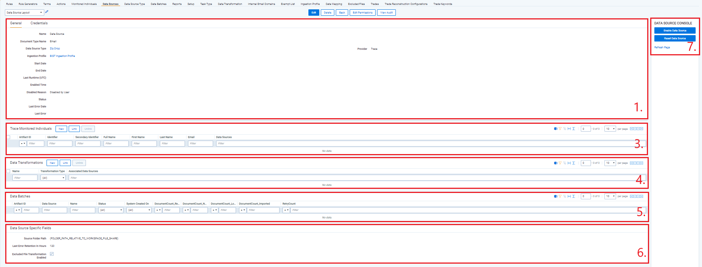
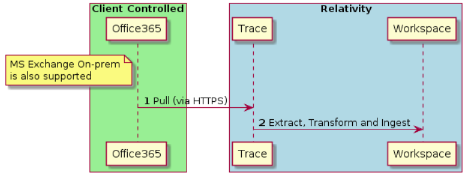
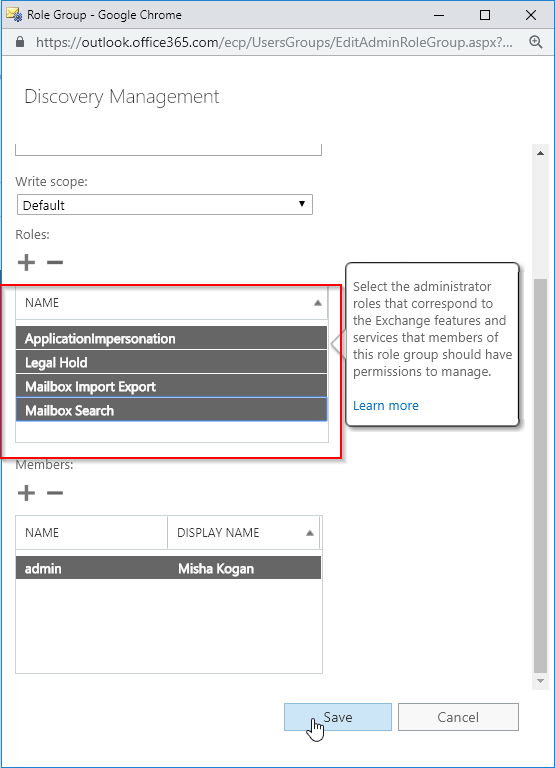
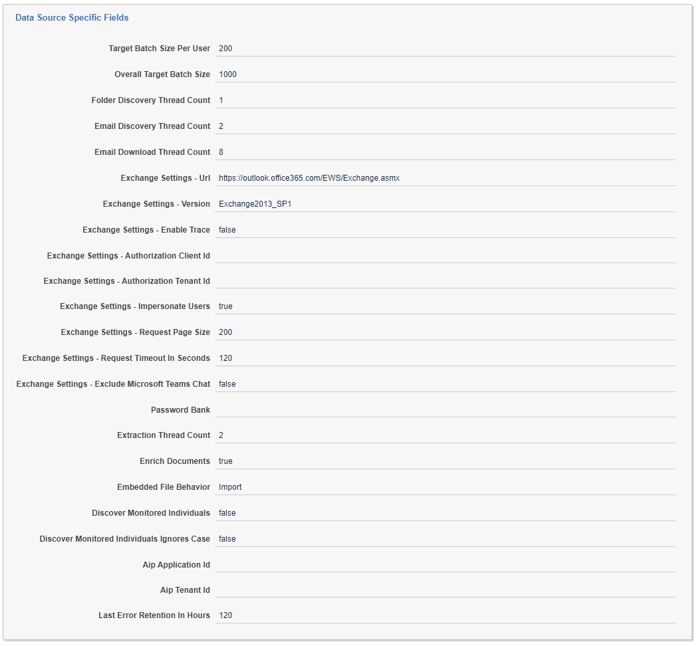
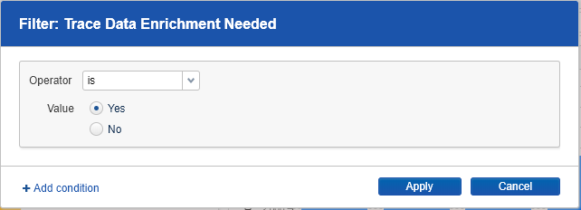

# Data Sources
{: .no_toc }

A Data Source allows you to define where and how you are pulling data from a communication channel.
{: .fs-6 .fw-300 }

1. TOC
{:toc}

---

## Overview
 A Data Source stores the configuration necessary to retrieve data from a communication channel, process that data, and ingest it into Relativity Trace. Data Sources reference an Ingestion Profile that holds configuration on how to import data for that Data Source (data mappings). Data Batches reference Data Source to dynamically lookup the Ingestion Profile to use during import.

Ingestion Profiles are susceptible to corruption by modification of Relativity Fields and Data Mappings which are referenced in the profile.  Any time a Relativity Field or Data Mapping which is used in an Ingestion Profile is edited or deleted, it is imperative to validate the integrity of each of the related Ingestion Profiles. Automatic validation occurs during the Data Retrieval task and may cause a data source to be automatically disabled if it is found to have been corrupted.
{: .warn }

### Sections of a Data Source

1. **General**: this tab houses general identifying information and status for the data source. These fields are described in further detail below.
   * **Name:** The name of Data Source
   * **Document Type Name:** A non-required name that will propagate to the Trace Type field on the documents that come in through this Data Source
     * If this field is left empty, the name of the Data Source will be used instead
   * **Data Source Type:** Type of the data source
   * **Ingestion Profile:** Ingestion Profile used to load data from this Data Source
* **Start Date:** Date from which data will be pulled/pushed into Relativity
* **End Date:** Optional date to which data will be pulled/pushed into Relativity.
  
* **Last Runtime (UTC):** The timestamp when this Data Source was last executed
  
   * **Status:** The last status message recorded by the Data Source

   * **Last Error Date:** Timestamp of the last time this Data Source failed, if it happened recently (based on Last Error Retention in Hours setting under Data Source Specific Fields)
   
   * **Last Error:** Error message from the last time this Data Source failed, if it happened recently (based on Last Error Retention in Hours setting under Data Source Specific Fields)
2. **Credentials:** this tab is used to securely input and store credential information. This includes username and password as well as OAuth client secrets, should they be used. Not all Data Sources require credential information.
   
    * **Username:** Optional field used for authentication of a data source.
    
    * **Password:** Optional field used for authentication of a data source.
    
    * **AIP Client Secret:** Optional field used for authentication of AIP decryption using OAuth. See [Trace and Azure Information Protection](#trace-and-azure-information-protection) for more information. 
    
    * **EWS Client Secret:** Optional field used for authentication of exchange email retrieval using OAUT.
    
      > EWS Client Secret is used only on Microsoft Exchange type Data Sources. See [Microsoft Exchange Data Source](#microsoft-exchange-data-source) for specifics on authentication.
3. **Trace Monitored Individuals:** Configures which monitored individual’s data should be retrieved from the data source. See [Monitored Individuals](#monitored-individuals) for more information.
4. **Data Transformations:** Determines which data transformations to apply to documents prior to ingestion into Relativity by this data source. See [Data Transformations](#data-transformations) for more information.
5. **Data Batches:** The data batches which have been generated by this data source. See [Data Batches](#data-batches) for more information.
6. **Data Source Specific Settings**: Different data source types have different configuration options. This section updates dynamically to allow access to these configuration options. See [Data Source Specific Settings](#data-source-specific-settings) and the documentation of your specific Data Source Type for more information.
7. **Console**
   
    - **Enable/Disable Data Source:** Enables (or disables) data retrieval for a particular data source.
    - **Reset Data Source:** Disables *and* resets data source to retrieve data from the specified Start Date. 
    
      > Depending on Import settings, enabling a reset Data Source could duplicate data in the Workspace.
      {: .info }

### Data Source Specific Settings

This section contains additional settings which are not associated with specific Relativity Fields. The settings described here are common across all Data Source Types. Type-specific settings are documented under their respected Data Source sections.

-   **Password Bank** Used to specify known passwords to attempt while encountering protected native files. Multiple passwords can be separated by the pipe character, `|`. Passwords containing the pipe character are supported through escaping the pipe character with a second pipe. Pipes are always escaped left to right.
    
    > **Example Password Bank:** `passw0rd|Trace1234!|aaa|bb|cccc||dd||eee|||ff|||ggg||||hhh|||||`
    >
    > Yields the following passwords:
>
    > * `passw0rd`
    > * `Trace1234!`
    > * `aaa`
    > * `bb`
    > * `cccc|dd|eee|`
    > * `ff|`
    > * `ggg||hhh||`

- **Extraction Thread Count:** The number of documents to extract in parallel.

- **Enrich Documents:** Whether or not to extract metadata and children from original documents. Valid values: 

  -   `true`
  -   `false`

- **Embedded File Behavior:** Embedded files are defined as attachments without file names. Most commonly these are in-line images. This setting changes the import behavior for embedded files. Valid options are:

  -   **`Import`** - Import all embedded files (top level and child) as separate documents in Relativity Trace.
  -   **`DoNotImportFromAttachments`** - Import embedded files from top level documents *only*. Do not extract embedded files from child documents.
  -   **`DoNotImport`** - Do not import any embedded files.
>   Both the `Import` and `DoNotImportFromAttachments` settings will greatly increase document volumes in Relativity Trace.
{: .info}

- **Discover Monitored Individuals:** See [Discovery of Monitored Individuals](#discovery-of-monitored-individuals)
- **Include Monitored Individuals Not Linked to Data Source:** See [Discovery of Monitored Individuals](#discovery-of-monitored-individuals)
- **Discover Monitored Individuals Ignores Case:** See [Discovery of Monitored Individuals](#discovery-of-monitored-individuals)
- **Last Error Retention In Hours:** The length of time to persist any message in the `Last Error` field.
- **Aip Application Id:** See [Trace and Azure Information Protection](#trace-and-azure-information-protection) 
- **Aip Tenant Id:** See [Trace and Azure Information Protection](#trace-and-azure-information-protection)

### Data Source State Serialization

Globanet and Zip Drop Data sources created in Trace serialize their current state as a JSON file at regular intervals. This data is designed to be retrieved by the Trace Shipper Service to facilitate integrations with external data sources. 

The serialized data source file is saved in {Source/Drop Folder}\Config\DataSourceState.json, where {Source/Drop Folder} is the configured source or drop folder for the given data source. If the data source has been deleted, the deleted field is set to True in the JSON file and the file will no longer be updated. 

All fields for a data source, including Data Source Specific Fields, are saved except fields including personal/private information (such as passwords and secrets). Different fields are set to be excluded depending on the type of data source. 
Data source state serialization currently excludes the following fields from being saved:

- Username
- Password
- Password Bank
- Aip Client Secret
- Aip Application Id
- Aip Tenant Id
- Exchange Url
- Exchange Authorization Client Id
- Exchange Authorization Tenant Id
- EWS Client Secret
- Drop Folder Path

Other data source types can serialize their state as well, if this functionality is needed please contact support@relativity.com.
{: .info }

### Data Source Auto-Disable

Trace will automatically disable data sources that are identified as unhealthy or have critical configuration errors that will require intervention by the user. Trace will automatically disable a data source for the following reasons:

- Data source has not had any successful data batches in a configured amount of time (default 24 hours)
- Globanet data source is enabled without enabling Globanet (Merge1) at the workspace level

Auto-disabled data sources will have their Disabled Reason field populated to show that it was disabled by the system. The data source will also have error details outlining the failures that caused the system to disable it. 

### Microsoft Exchange Data Source
{: .d-inline-block }

Replaced by O365 Data Source
{: .label .label-yellow }

The Microsoft Exchange Data Source enables Relativity to automatically pull emails from a Microsoft Exchange instance (Office 365 or On Premises) into Relativity. The Microsoft Exchange Data Source is executed by the Data Retrieval task (seen on the Setup tab). Note, this Data Source only pulls emails at this
time, if you need to retrieve other object types from Microsoft Exchange please contact [support@relativity.com](mailto:support@relativity.com).

**Data Flow Overview**

**Setup**

**Step 1: Create Ingestion Profile**

>   Refer to **[Appendix C](#appendix-c-create-email-fields-data-mappings-and-ingestion-profile)**

**Step 2: Adjust Office 365 permissions**

Settings for On Premises exchange are very similar to Office 365. Setting user permissions only applies if you are using Basic Authentication or OAuth Resource Owner Password Credential Grant (see authorization.md for more details).
{: .info }

1.  Log into the Office 365 Admin Center

2.  Adjust Administration Exchange settings:

    

3.  Under Admin Roles create (or update if exists) Discovery Management role:

    

4.  Ensure the account you use to authenticate with includes “Application
    Impersonation”, “Legal Hold”, “Mailbox Import Export” and “Mailbox Search”
    roles:
   
   

5. (Optional) Adjust password expiration permission for the account used for Trace

     https://docs.microsoft.com/en-us/office365/admin/add-users/set-password-to-never-expire?view=o365-worldwide#set-the-password-expiration-policy-for-individual-users

**Step 3: Create a Microsoft Exchange Data Source**

1.  Go to the Trace:Data Sources Tab and Click the “New Data Source” Button

2.  Set the Name = “*Microsoft Exchange*” (for example)

3.  Select Data Source Type: “Microsoft Exchange”

    

4.  Select Ingestion Profile created in Step 1

5.  Set the required credentials depending on your authentication method (see authorization.md for more details).
    
7.  Set Start Date to the earliest email timestamp you would like imported (UTC
    time)

8.  Optionally set End Date to the latest email timestamp you would like imported (UTC
    time)
    
9.  Under Data Source Specific Fields, set Exchange Settings - Url and Exchange
    Settings - Version (there are a lot of other settings that can be
    configured, but the default values are fine, please contact us if you would
    like more information)
    
    
1.  *Exchange Settings – Url* gives you the chance to specify the exact URL used when connecting to your exchange server. If this field is left blank, Microsoft’s Autodiscover technology will be used to populate the field with a URL based on the credentials provided in the Username and Password fields. Autodiscover is typically a suitable option and works for Office 365 and many on premises solutions but it is not guaranteed to work.
    
        If Autodiscover fails, specify this URL in the field: https://outlook.office365.com/EWS/Exchange.asmx ( OR https://YOUR_EXCHANGE_SERVER_URL/EWS/Exchange.asmx)
    
2. *Exchange Settings - Version* allows you to specify the version of your exchange server. For Office 365, the default is the correct choice. For on premises servers, provide the correct version. It needs to be an exact match to one of the options, filling it out incorrectly will provide a list of all of the options available in the error message at the top of the page: Exchange2007_SP1, Exchange2010, Exchange2010_SP1, Exchange2010_SP2, Exchange2013, Exchange2013_SP1
   
10. *Exchange Settings - Exclude Microsoft Teams Chat* indicates whether Trace will ignore any Microsoft Teams chat messages being stored in a Monitored Individual's folders in Outlook as a part of O365. The default behavior is to pull data from the Teams Chat folder, but users may want to exclude these folders if Teams data is being pulled from a different data source or the data should not be pulled at all.

11. Click “Save”

12. Link / Create New Monitored Individuals (same page after clicking Save)

    

    1.  Click `New` if the monitored individual is not already defined on another Data Source, or “Link” if the user has already been monitored in the past
    
2.  Microsoft Exchange Data Source will only pull data for linked Monitored Individuals (by identifier field: email address)
    
    3.  Once everything is set up, click the Enable Data Source button on the upper right to begin pulling data

**Content**

The Microsoft Exchange Data Source works by pulling content directly from an Exchange Server instance (Office 365 or On Premises) using Exchange Web Services (EWS). The Data Source downloads the native (.eml) email files and then extracts all information including email metadata, email body text, native attachments and their metadata. Container attachment file types (zips and similar archives) are automatically extracted into individual documents – e.g. zip with 10 word (.docx) documents = 11 Relativity documents. In addition, images from email content and each individual document are automatically expanded into separate Relativity documents. 

The Microsoft Exchange data source only retrieves emails. It does not retrieve other exchange metadata at this time.
{: .info }

Please, refer to [Appendix B: Trace Document Extraction Fields](#appendix-b-trace-document-extraction-fields) for field descriptions.

### Zip Drop Data Source

The Zip Drop Data Source Type allows Relativity Trace to import of fully formed data batches (documents, extracted text and associated metadata) in the form of ZIP files dropped into a defined Drop Folder on the Relativity workspace file share. The Zip Drop Data Source Type is particularly useful for data like audio where partners produce data in its final state (natives, extracted text and metadata) and need a simple way to get it into Relativity Trace without making any API calls. The Zip Drop Data Source Type meets this need by monitoring the drop folder and pulling every ZIP file placed there into the system as a new Data Batch. The Zip Drop Data Source Type works especially well when combined with the Trace Shipper Service, which can be used to deliver archived data batches from servers outside of the Relativity instance directly to the drop folder where they are consumed by the Zip Drop Data Source.

**Configuration**

Configuration for the Zip Drop Data Source is pretty simple. There are no credentials or start date required. In fact, there are only a few things that need to be set up:

- **Drop Folder Path** - Path where ZIP files will be retrieved by the data source, relative to the root of the file share for the workspace (beneath the EDDSXXXXXX folder). The Drop Folder does not need to exist when settings are saved as it will be created automatically. If the file path does not resolve to a location within the file share for the workspace, an error will be thrown.
- **Ingestion Profile** - See Appendix C for more information on Ingestion Profiles.

**ZIP File Format**

The following requirements must be met by any ZIP file imported by the Zip Drop Data Source:

- The name of the ZIP file is the name of the Data Batch that will be created, and should be unique
- There must be a load file at the root of the ZIP file named "loadfile.dat"
- There should be no other files at the root of the ZIP file except for "loadfile.dat"
- All native files should be in a folder named "OriginalNatives" at the root of the ZIP file
- All extracted text files should be in a folder named "ExtractedData" at the root of the ZIP file
- There should be no folders at the root of the ZIP file except for "OriginalNatives" and "ExtractedData"
- The load file "loadfile.dat" must contain columns named "Trace Monitored Individuals", "Trace Document Hash", and "Trace Data Batch" in addition to the other columns and data mappings that are required by every Relativity Trace data source

Files imported by the Zip Drop Data Source do not need to have the extension .ZIP.
{: .info }

**Drop Folder**

The Drop Folder is the place on the file share where ZIP files full of documents and metadata should be placed. The Zip Drop Data Source will discover ZIP files, extract them to a different location, and then delete each ZIP file from the Drop Folder so that the next file can be processed. The Zip Drop Data Source attempts to extract every file in the Drop Folder, regardless of extension. Only one file is processed at a time, so the file is always moved or deleted after a single attempt to guarantee throughput. 

When selecting a file to import, the Zip Drop Data Source will always start with the oldest file present in the Drop Folder. If the file name contains "_inprogress", the file will be skipped. This convention allows integration partners a failsafe way to indicate a file is still being transmitted to avoid failures where extraction is attempted before the file is fully written. The file can then be renamed when it is fully written. As an additional safety measure, the Zip Drop Data Source will obtain and release a write lock on any file before attempting to extract it. If a write lock cannot be obtained, the file will be skipped under the assumption that it is still being written.

**Zip Drop Data Batches**

Once a ZIP file is extracted, a Data Batch RDO is created. The name of the Data Batch RDO will be the same as the name of the ZIP file, minus the extension. If a Data Batch RDO with that name already exists, the name will be adjusted to contain the duplicate count in parentheses (eg. Data Batch (2)). The load file will be adjusted automatically so that the documents within are associated with the correct Data Batch by name.

Once created, the Data Batch RDO will be given a status of ReadyForImport. Because of this, Zip Drop Data Sources do not support Data Enrichment - the load file in the ZIP must already contain all of documents, extracted text and metadata needed for the Data Batch. However, Data Transformations occur prior to import and therefore are supported for the Zip Drop Data Source.

**Failure Scenarios**

There are a few different unique failure scenarios for the ZIP Drop Data Source. Regardless of the scenario, every file placed in the Drop Folder will result in a Data Batch RDO and the dropped data will not be lost.

The first scenario is if a file placed in the Drop Folder cannot be extracted. This is most common if the file is not actually a ZIP file. In this case, a Data Batch RDO will be created in CompletedWithErrors status with error details and the file will be moved to a FailedToExtract folder within the Drop Folder. The only way to retry a file in this scenario is to manually move it back to the Drop Folder. In the event that multiple files with the same name fail to be extracted, only the most recent file with a given name will be retained in the FailedToExtract folder, so please make sure that ZIP files containing unique data have unique names.

The second scenario is that the ZIP file (or the load file it contains) does not match the requirements specified above in "Zip File Format". In this case, a Data Batch RDO will be created in CompletedWithErrors status explaining the error and the ZIP file will be extracted to the normal data batch folder location on the file share, just as if it had been a healthy data batch. The load file will exist at the load file path on the Data Batch RDO as long as it was included in the ZIP file. It is possible to retry Data Batches in this state using the Data Batch Retry console button, but the files will need to be modified in the extracted data batch folder on the file share to meet the requirements or the Data Batch will just fail again. In most cases it is better to just Abandon the Data Batch and drop a corrected ZIP file in the Drop Folder.

All other Data Batch failure scenarios with the ZIP Drop Data Source occur once the ReadyForImport status is reached and are not unique to this data source type. Please reference the rest of this documentation for more details on other requirements for Data Ingestion using Relativity Trace.

**Monitored Individuals CSV**

ZIP Drop Data Source will export its configured Monitored Individuals in CSV format every time the Drop Folder is checked for new files. The CSV will be located at `(Drop Folder)\Config\monitored_individuals.csv`.

### Relativity Native Data Extraction Data Source

This Data Source allows for automatic text extraction/expansion of previously ingested documents with natives in Relativity. This data source will automatically extract text, metadata and any children documents from containers/archives for all documents in the workspace with *Trace Data Enrichment Needed* field set to *Yes* and where Trace is able to locate the Native file on disk:

**Setup:**

1. Integration Points Profile

   1.  Please, re-use profile creation steps documented for Microsoft Exchange above OR re-use existing “Microsoft Office 365 Profile” profile. 
       
       > **IMPORTANT:** Ensure import option is set to Append/Overlay.
   
2.  Create Relativity Native Data Extraction Data Source

    1.  Go to the `Trace` -> `Data Sources` tab and Click the “New Data Source” button

    2.  Set the Name = for example, “Native Data Extraction”

    3.  Select Ingestion Profile created in Step 1

    4.  Select Data Source Type: “Relativity Native Data Extraction”

    5.  Ignore Username field

    6.  Ignore Password field

    7.  Ignore Start Date field

    8.  Ignore End Data field

    9.  You have the option to leave the Data Source as Enabled or Disabled

3.  Fill out [Data Source Specific Settings](#data-source-specific-settings) and click Save
    
    -   **Batch Size:** The maximum number of Original Native files to group into a single Data Batch

**Content**

Extracted text and metadata for submitted Native files and all children documents expanded from containers/archives. Please, refer to [Appendix B](#appendix-b-trace-document-extraction-fields) for field descriptions.

Re-extraction of child documents from containers (emails, zips, archives) will generate duplicate child documents (old children will be dropped off the family group) if they already exist in the workspace.
{: .warn }

Containers with many children documents (and nested containers) could produce significant number of expanded items in Relativity.
{: .warn }

**Limitations**

Relativity Native Data Extraction Data Source do not support [Deduplication](#deduplication-data-transformation). Deduplication transformations must be unlinked before the Data Source can be enabled.

Discovery of Monitored Individuals
--------------------------------------------

Some Data Sources combine data from several places into a single import flow. In that scenario, it may not be clear which Monitored Individual is the source of a given document and no Monitored Individual will be tagged. To address this issue, Trace has introduced the `Discover Monitored Individuals` option on every Data Source. If enabled, Trace will look inside of the document and tag Monitored Individuals defined on the Data Source if they are found in headers inside the document. Monitored Individuals are recognized by identifier and all secondary identifiers. 

There is also the option to discover Monitored Individuals that are not linked to the Data Source with the setting `Include Monitored Individuals Not Linked To Data Source`. If `Discover Monitored Individuals` is false, this setting will take no action. If `Discover Monitored Individuals` is true and `Include Monitored Individuals Not Linked To Data Source` is false, this setting will take no action and it will only discover Monitored Individuals that are linked to that Data Source. If `Discover Monitored Individuals` is true and `Include Monitored Individuals Not Linked To Data Source` is true, it will use all of the Monitored Individuals in the workspace to tag documents.

By default, Monitored Individual discovery ignores case in the domain portion of the email address but not the name portion. For example, John.DOE@URL.COM will match John.DOE@url.com, but not john.doe@url.com.
{: .info }

To ignore case in the entire email address during Monitored Individual discovery, use the `Discover Monitored Individuals Ignores Case` setting. For example, John.DOE@URL.COM  will match always John.DOE@url.com, but only match john.doe@url.com if Discover Monitored Individuals Ignores Case is set to true.
{: .info }

### Monitored Individual Discovery On Merge1 Data Sources

Merge1's EWS Data Source only looks for Monitored Individuals in the `X-UserMailbox` header of an email. This header is provided by Merge1 and typically contains exactly one Monitored Individual.

### Monitored Individual Discovery On Other Data Sources

All other data sources discover Monitored Individuals based on the `FROM`, `TO`, `CC`, and `BCC` headers. Any Monitored Individual on the Data Source with an identifier (primary or secondary) contained in any of these headers will be associated with the document.

### Supported File Formats

Discovery of monitored individuals is based on finding the email addresses of monitored individuals in the headers of an email file. Therefore, it will only work properly on .eml, .msg, and .rsmf (Relativity Short Message Format) files. Any other file format is not currently supported.
