# Data Transfer
{: .no_toc }


On-premises data can be transferred to Relativity Trace in the cloud using either Trace Shipper or SFTP.
{: .fs-6 .fw-300 }

1. TOC
{:toc}

---

## SFTP

Basic information on our SFTP data transfer approach can be found in our [RelativityOne Documentation](https://help.relativity.com/RelativityOne/Content/Data_migration/S-FTP.htm).
Relativity Trace supports the following Data Sources via SFTP:
1. Microsft Exchange On-Prem (EML loose files)
2. Enterprise Vault On-Prem via Relativity VerQu
3. Bloomberg Chat and Mail (zipped package)
4. Audio Transcript
5. ZipDrop Data Source

## Trace Shipper

The Trace Shipper Service is a Windows service released by Trace that delivers data from the client network to a remote Relativity Trace workspace. The service monitors configured source folders on the local network and ships files that appear in the source folders to predetermined file share locations within a Relativity workspace that are associated with Trace Data Sources. The files are deleted from the source folder once they have been transmitted to Relativity successfully. 


### Trace Data Shipper Advantages

1. Fully managed Windows service with Trace specific semantics and configuration
   1. Integration with IT policies managing Windows reporting/alerting.
   2. Robust mechanism for retrying in case of data transfer failures.
   3. Integration of Data Source configuration from Relativity side.
2. No need for VPN setup
   1. Faster onboarding of clients.
   2. Fewer dependent components in data transfer.
3. Fast data transfer rates.
4. Secure (data encrypted in flight).

### Prerequisites Before Installing

1. Trace application needs to be installed on the Relativity Workspace.
2. Identify/provision a Windows machine to run the Trace Shipper Service.
  1. System Requirements
        1. Hardware:
       1. 2.4 GHz or faster 64-bit dual-core processor.
       2. 16 GB RAM.
       3. 300 GB hard-disk space.
        2. Software:
       1. Windows 8 or later; Windows Server 2012 or later.
       2. .NET Framework 4.7.2.
  2. Ports and Firewall settings
     1. For the Aspera data transfer protocol, the following ports must be configured:
        1. **TCP port 443** - required to be opened for the **[customerinstance].relativity.one** endpoint
        2. **TCP port 33001** - required to be opened for the `IP Range` listed in  [RelativityOne data transfer IP Range](https://help.relativity.com/RelativityOne/Content/Getting_Started/RelativityOne_technical_overview.htm#Fully) table
           1. **Please, disregard `VPN Portal URL` column and all information related to `VPN`, use only IP Range from `Primary IP Range` column for a given `Primary Azure Region`**
           {: .info }
           2. IP Min and Max can be calculated using tools such as https://jodies.de/ipcalc
           {: .info }
        3. **UDP ports 33001 - 33050** - required to be opened for the IP Range listed in  [RelativityOne data transfer IP Range](https://help.relativity.com/RelativityOne/Content/Getting_Started/RelativityOne_technical_overview.htm#Fully) table
           1. **Please, disregard `VPN Portal URL` column and all information related to `VPN`, use only IP Range from `Primary IP Range` column for a given `Primary Azure Region`**
           {: .info }
           2. `IP Min` and `Max` can be calculated using tools such as https://jodies.de/ipcalc
           {: .info }
3. Create/identify a Windows user to run the service (Log on as...) that has access to all folders that need to be shipped and that can be allowed access to Relativity user credentials stored in configuration.
4. Identify what source folder(s) on your local network need their files shipped to a Relativity Windows service. The newly created Windows user must have read/write/modify permissions to the source folder(s).
5. Lookup the destination Relativity Instance URL(s) and Workspace(s).
   _ Lookup Target folder(s) (**Source Folder Path**) on the destination fileshare(s) where the files should be shipped (configured as part of creating Trace Data Sources).

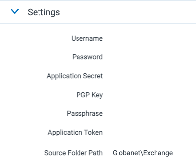

A document will fail to ship if a file with the same name already exists in the destination folder. Care should be taken to avoid duplicate file names both when initially retrieving data and at the remote destination folder.
{: .info }

- Create a designated Relativity username and password for each destination that can be used to authenticate against a Relativity API with appropriate rights.

To view the file shares the user must be in a group, other than the System Administrator group, that is added to at least one workspace built on the Resource Pool with the associated file shares.
{: .info }

  Step by step procedure to configure Relativity Group and User:

  a) Open RelativityOne portal.

  b) Create a new Group e.g. **Trace Shipper Aspera**.

  

  c) Create a ne User e.g. **Trace Shipper**.

  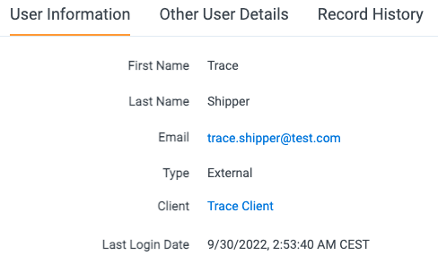

  d) Once the user is created, add Default Password Provider Login Method to it. Use the following parameters: **Can Change Password** set to true, **Require Change Password On Next Login** set to false, **Maximum Password Age** set to false, **Set Password for User** set to yes. Then type password and confirm.

  

  e) Add **Trace Shipper** User to **Trace Shipper Aspera** Group.

  f) Open **Instance Details** and **Manage Permissions**. On **Group Management** tab add **Trace Shipper Aspera** Group to the Instance.

  

  g) On **Admin Operations** tab, select **Trace Shipper Aspera** Group then check **Access RelativityOne Staging Explorer** option. Then click **Save** and **Close**.

  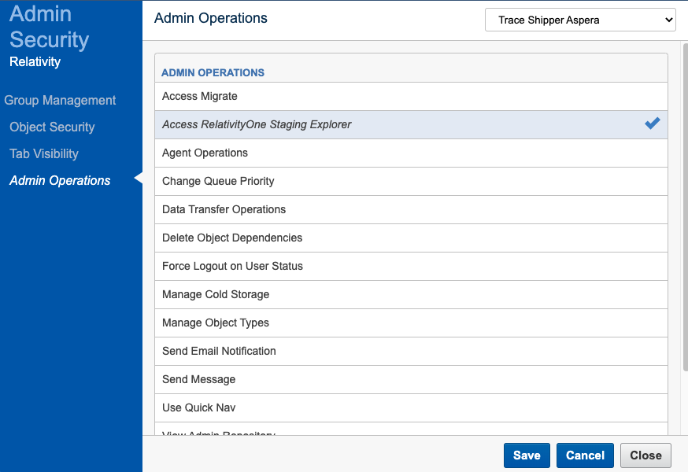

  h) Go to Trace Workspace. Open **Workspace Details** and **Manage Workspace Permissions**. On **Group Management** tab add **Trace Shipper Aspera** Group to the Workspace.

  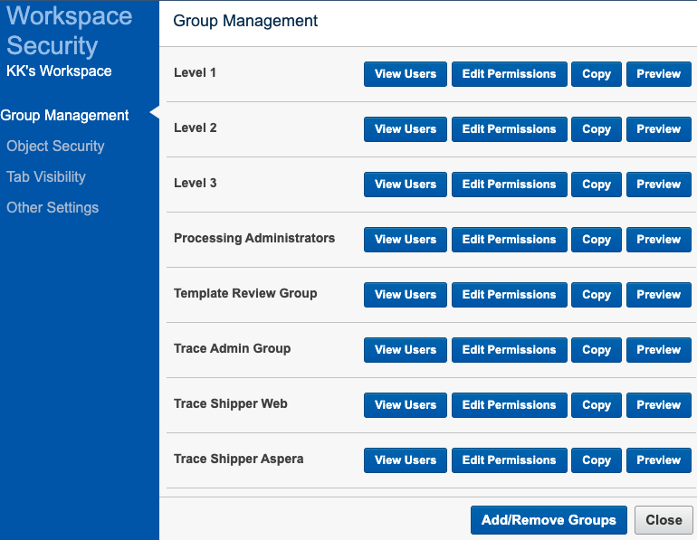

  i) View **Trace Shipper Aspera** Group Users to confirm **Trace Shipper** User is present.

  

  j) Open **Trace Shipper Aspera** Group again. Confirm that Trace Shipper User and Trace Workspace is linked to it.

- Request the Trace Shipper deployment package by submitting a ticket to [support@relativity.com](mailto:support@relativity.com).

- Download and install ROSE (Staging Explorer), login to ROSE as **Trace Shipper** User and Password and run Test Connectivity ([available here](https://help.relativity.com/RelativityOne/Content/Relativity/RelativityOne_Staging_Explorer/RelativityOne_Staging_Explorer.htm#connection)).

This step is requried to confirm that all TCP and UDP ports required for transferring data from the client local machine to the RelativityOne instance are opened.
{: .info }

- (Only for Web protocol) Request the Relativity Transfer API Services application (Relativity.TransferApi.Services.rap) by submitting a ticket to support@relativity.com. [Install](https://help.relativity.com/10.3/Content/Relativity/Applications/Installing_applications.htm#Installi3) the Relativity Transfer API Services application to the Application Library.

Do not install the Relativity Transfer API Services application to any workspaces. By installing the application to the Application Library, the services are available for consumption.
{: .info }

- (Only for Web protocol) Assign required permissions to Relativity user
   a) Go to Instance Details/Manage permissions.
   b) Go to Admin Operations and select a group the user belongs to.
   c) Check "Data Transfer Operations" permission.

### Installation Steps

1. Extract `TraceShipperService_(version).zip` to a folder called `Trace Shipper Service` on the machine that will be running the service. Make sure that the files are directly under the `Trace Shipper Service` directory with no extra nested folders.
2. Run a command prompt AS ADMINISTRATOR, navigate to the `Trace Shipper Service` folder in the command prompt, and run `TraceShipperService.exe /i`
3. Go to Services on the machine and verify that the service was installed (`Trace Shipper Service`)
4. From the Services window, right click on the `Trace Shipper Service` and select Properties, and then on the Log On tab configure the service to run as the user with proper access to the local folders
5. In the `Trace Shipper Service` folder, edit the `serviceConfiguration.json` file. 
All fields must comply with JSON formatting. The type of each value is specified below. Special characters (for `\` and `"`) will need to be escaped by a `\` character.

Sample configuration file

```json
{
	"shippers": [{
			"localDirectoryPath": "C:\\Users\\superuser\\Downloads\\Globanet3
			Exchange",
			"remoteRelativePath": "Globanet
			Exchange",
			"logFilePath": "C:\\Users\\superuser\\Downloads\\Globanet3\\Logs
			Shipper_Exchange.log",
			"externalServiceLogLocations": [
				{
					"logFilePath": "C:\\Users\\superuser\\Downloads\\Globanet3\\Logs\\Office 365.log",
					"uniqueRemoteName": "Exchange.log"
				}
			],
			"logLevel": "Information",
			"relativityUrl": "https://trace.relativity.one",
			"relativityUserName": "trace.shipper@test.com",
			"relativityPassword": "SomePassword!!!!",
			"workspaceId": 5345612,
			"localConfigDestinationPath": "",
			"remoteRelativeConfigPath": "",
			"retrieveConfigurationIntervalInMinutes": 5,
			"cacheLengthInMinutes": 20,
			"logUploadIntervalInMinutes": 10,
			"clientType": "Aspera"
		}, {
			"localDirectoryPath": "C:\\Users\\superuser\\Downloads\\Globanet3
			Teams",
			"remoteRelativePath": "Globanet
			Teams",
			"logFilePath": "C:\\Users\\superuser\\Downloads\\Globanet3\\Logs
			Shipper_Teams.log",
			"externalServiceLogLocations": [
				{
					"logFilePath": "C:\\Users\\superuser\\Downloads\\Globanet3\\Logs\\Teams.log",
					"uniqueRemoteName": "Teams.log"
				}
			],
			"logLevel": "Information",
			"relativityUrl": "https://trace.relativity.one",
			"relativityUserName": "trace.shipper@test.com",
			"relativityPassword": "SomePassword!!!!",
			"workspaceId": 5345612,
			"localConfigDestinationPath": "",
			"remoteRelativeConfigPath": "",
			"retrieveConfigurationIntervalInMinutes": 5,
			"cacheLengthInMinutes": 20,
			"logUploadIntervalInMinutes": 10,
			"clientType": "Aspera"
		}, {
			"localDirectoryPath": "C:\\Users\\superuser\\Downloads\\Globanet3
			OneDrive",
			"remoteRelativePath": "Globanet
			OneDrive",
			"logFilePath": "C:\\Users\\superuser\\Downloads\\Globanet3\\Logs
			Shipper_OneDrive.log",
			"externalServiceLogLocations": [
				{
					"logFilePath": "C:\\Users\\superuser\\Downloads\\Globanet3\\Logs\\OneDrive.log",
					"uniqueRemoteName": "OneDrive.log"
				}
			],
			"logLevel": "Information",
			"relativityUrl": "https://trace.relativity.one",
			"relativityUserName": "trace.shipper@test.com",
			"relativityPassword": "SomePassword!!!!",
			"workspaceId": 5345612,
			"localConfigDestinationPath": "",
			"remoteRelativeConfigPath": "",
			"retrieveConfigurationIntervalInMinutes": 5,
			"cacheLengthInMinutes": 20,
			"logUploadIntervalInMinutes": 10,
			"clientType": "Aspera"
		}
	]
}
```

See [this guide](https://developer.mozilla.org/en-US/docs/Web/JavaScript/Reference/Global_Objects/JSON) for help with JSON formatting.
{: .info }

   The root object has a single `shippers` property, which is an array of objects with the following properties:

   | Name                                   | Required | Type             | Description                                                  |
   | :------------------------------------- | :------- | :--------------- | :----------------------------------------------------------- |
   | localDirectoryPath                     | yes      | string           | The locally accessible path of the folder that needs to ship files (note the user running the service must have access) |
   | remoteRelativePath                     | yes      | string           | The path relative to the workspace fileshare root of the destination workspace where all files should be stored |
   | retrieveConfigurationIntervalInMinutes | no       | number           | The interval between Data Source configuration pulls from Relativity. Values less than or equal to 0 turns off this feature. This setting is used to synchronize, for example, monitored individuals and data source state from Relativity One to a local Veritas Merge1 instance. For further customization of Data Source configuration pulling, contact support@relativity.com.<br />*Default: 0 (off)* |
   | remoteRelativeConfigPath               | no       | string           | Location of the remote Config folder to retrieve, relative to the workspace fileshare root of the destination workspace. The default should be correct for most situations. This setting is ignored if `retrieveConfigurationIntervalInMinutes` is less than or equal to 0. Contact support@relativity.com prior to changing this value.<br />*Default: `**remoteRelativePath**\Config`* |
   | localConfigDestinationPath             | no       | string           | The full path to the local folder where the remote Config directory should be downloaded. This will create a subdirectory named `Config` in the configured location and contents of the remote Config folder will be placed inside. This setting should only be changed if necessary.<br />*Default: the value of `localDirectoryPath`* |
   | cacheLengthInMinutes                   | no       | number           | How long a file is ignored by monitoring before Trace Shipper Service attempts to send it to Relativity again (provides a buffer for long transfer times and surges in volume as well as automatic retries of failed transfers)<br />*Default: 20* |
   | logLevel                               | no       | string           | The minimum message level to include in the log file (Verbose/Debug/Information/Warning/Error/Fatal), increase if log files are too large, decrease when troubleshooting. <br />*Default: Warning* |
   | logFilePath                            | yes      | string           | A local file path **ACCESSIBLE TO THE SERVICE USER** where the log files for the application should be stored. The log files roll automatically every 100MB, so there will be more than one file, it is best to dedicate a folder to these Trace Shipper logs. Each configured local folder requires a unique `logFilePath` |
   | logUploadIntervalInMinutes             | no       | number           | How frequently Trace Shipper Service pushes its log files to the Relativity workspace fileshare, contact support@relativity.com for more information before changing this setting.<br />*Default: 10* |
   | externalServiceLogLocations            | no       | array of objects | An array of External Service Log Locations to push to the Relativity workspace fileshare. See below for definition of each object<br />*Default: [] (empty)* |
   | clientType                             | no       | string           | Transfer API client type to use, current supported options are Aspera, Fileshare and Web, contact support@relativity.com for more information<br />*Default: Aspera* |
   | relativityUserName                     | yes      | string           | The username used to connect to Relativity to upload files. **It is recommended to secure the TraceShipperService folder as a way to reduce risk of exposing these credentials.** |
   | relativityPassword                     | yes      | string           | The password used to connect to Relativity to upload files. **It is recommended to secure the TraceShipperService folder as a way to reduce risk of exposing these credentials.** |
   | relativityUrl                          | yes      | string           | The URL of the Relativity Instance where the files will be shipped. |
   | workspaceId                            | yes      | whole number     | The workspace ID of the workspace where the files will be shipped. |

   The External Service Log Location object is described by the following properties:

   | Name             | Required | Type   | Description                                                  |
   | :--------------- | :------- | :----- | :----------------------------------------------------------- |
   | logFilePath      | yes      | string | The path to the external service log to ship. The final element of this path is not necessarily an existing file, but rather a pattern to match existing files. A wildcard match is inserted after the filename, before the file extension. All files matching this pattern are considered equivalent for shipping, and the only newest files will be transferred.<br />**For Example:** If logs of the form `\path\to\EWS.mm-dd-yyyy.log` are to be shipped, the setting should read (excluding escape characters for clarity) `\path\to\EWS.log`. This setting will match any file in `\path\to\` of the form `EWS*.log`. By using this template scheme, logging systems which include the date of the log and/or an index can be transferred. |
   | uniqueRemoteName | no       | string | The file name of the log on the remote Relativity fileshare. All external service logs are shipped to the same remote path (`**remoteRelativePath**\Logs`). If you need to transfer logs from two services with the same file name, this setting allows you to distinguish between them.<br />*Default: the filename and extension of the path in `logFilePath` of this External Service Log object* |

6. At times you may need to uncomment proxy settings in TraceShipperService.exe.config in `Trace Shipper Service` folder and set the correct address and port of proxy

```xml
<system.net>  
    <defaultProxy>  
	<proxy usesystemdefault="false" proxyaddress="http://host:8080"/>
    </defaultProxy>  
</system.net>
```

7. From the Services window, Start the `Trace Shipper Service`. If all configuration is correct, files should start departing the local source folders and showing up on the Relativity fileshare as configured.
8. If the Service fails to start, look at the Application Event Logs (Event Viewer > Windows Logs > Application) to see any errors.
9. If the Service starts but does not ship files, look at the log files (as configured in the logFilePath setting) to see what messages are logged.
10. Finally, once everything is running, use Windows permissions to secure the `Trace Shipper Service` folder and the configured logs folder to only users that should be able to access the sensitive information contained within (Relativity credentials, file paths, etc.).
11. (Optional) Create and configure Extension Scripts

### Comomon Errors

| Description | Log details example |
| :---------- | :---------- |
| Incorrect `relativityUrl` | 2022-09-30 11:10:20.604 [15] ERROR: Failed to call the HTTP 'Relativity.Rest/API/Relativity.Objects/workspace/-1/object/queryslim' (POST) endpoint operation. Web Response Status="NameResolutionFailure", Response= System.Net.WebException: The remote name could not be resolved: 'trace.relativity.oneddd' at System.Net.HttpWebRequest.EndGetRequestStream(IAsyncResult asyncResult, TransportContext& context) at System.Net.Http.HttpClientHandler.GetRequestStreamCallback(IAsyncResult ar)|
| Incorrect `workspaceId` | 2022-09-30 11:14:44.190 [19] WARNING: Successfully retrieved the '37022420' workspace from the '"https://trace.relativity.one/"' Relativity server but it does not exist. |
| Incorrect `relativityUserName` and/or `relativityPassword` | 2022-09-30 11:18:11.543 [21] ERROR: Failed to call the HTTP 'Relativity.Rest/API/Relativity.Objects/workspace/-1/object/queryslim' (POST) endpoint operation. HTTP StatusCode="Unauthorized", Response= System.Net.Http.HttpRequestException: Response status code does not indicate success: 401 (Unauthorized). at System.Net.Http.HttpResponseMessage.EnsureSuccessStatusCode() at Relativity.Transfer.RestClient.<ExecuteCall>d__20.MoveNext() |
| Incorrect `localDirectoryPath` | 2022-09-30 11:25:31.017 [11] WARNING: Failed to get files from folder J:\Users\superuser\Downloads\Globanet3\Exchange, will wait 60000ms then try again System.Exception: Folder path J:\Users\superuser\Downloads\Globanet3\Exchange cannot be found. at Insight.Core.FolderWatcher.FolderWatcher.WatchFolderAndQueueFiles(CancellationToken cancellationToken) in S:\Jenkins\workspace\Trace_Trace_csquared_master@2\source\Insight.Core\FolderWatcher\FolderWatcher.cs:line 85 |
| Incorrect `remoteRelativePath` | 2022-09-30 11:38:32.325 [4] WARNING: Begin shipping files from folder C:\Users\superuser\Downloads\Globanet3\Exchange. trace-shipper-version: 15.4.0.0 |
| Incorrect `logFilePath` | No Trace Shipper log available |

### Data Source Configuration Sync and Extension Scripts

Each configured shipper automatically syncs Data Source configuration (in Relativity). This configuration can be used to create custom actions that automatically trigger on certain events and changes:
1. Data Source settings snapshot (**monitored_individuals.csv**).
2. Monitored Individual changes (**DataSourceState.json**).

The local folder in which Data Source configuration is being stored is **localFolderPath\Config**.


### Starting/Stopping Service

The service can be managed directly from the Services application in Windows (you can quickly navigate to the window by executing `services.msc` in the Windows task bar).

### Update Steps

1. Extract `TraceShipperService_(version).zip` to a temporary folder.
2. Go to **Services** management console, locate **Trace Shipper Service** service and stop it.
3. Perform a backup of **Trace Shipper Service** production folder.
4. Go to new Trace Shipper unzipped, temporary folder, copy all files and place them onto **Trace Shipper Service** production folder.
5. Go to backup folder, copy `serviceConfiguration.json` and place it onto **Trace Shipper Service** production folder. This step is needed to recover original configuration file.
6. Optional - clean up logs.
7. Start **Trace Shipper Service**

### Recovery Steps

1. Stop **Trace Shipper Service**.
2. Restore backup.
3. Start **Trace Shipper Service**.

### Validation Steps

1. Drop a sample message onto the **Drop** folder.
2. Wait a minute.
3. Check if the message disappears from the **Drop** folder.
4. Check int the log if a transfer has been completed.

`INFORMATION: TransferJobMetricReporting: "1d2cc33a-4863-4b5a-8cea-de1f790cae9a" | CorrelationId: "c8811425-fde9-41ff-86ac-862f4b159ef3" | Transfer job completed. shipper-metrics-transfer-information: {"Mode":"Aspera","Status":"Successful","File Type":"Data","Request Name":"TraceShipper-upload","Direction":"Upload","Has Errors":false,"Error Message":"","Elapsed Time":"00:00:07","Total Files":171,"Total Transferred Files":171,"Total Transferred Bytes":34322167,"Total Files Not Found":0,"Total Files Failed":0,"Total Fatal Errors":0,"Total File Permission Errors":0,"Total Skipped Files":0,"Total Bad Path Errors":0,"Total Empty Directories Failed":0,"Data Rate":33.25,"Retry Count":0,"Issue Count":0,"Issues Messages":""}`

### Uninstall Steps

1. Run a command prompt AS ADMINISTRATOR
2. Navigate to the `Trace Shipper Service` folder in the command prompt
3. Run `TraceShipperService.exe /u`


## Extras

### Getting Started with Installation

To set up Trace Shipper, you will need:

1. A Trace Enabled Relativity Workspace along with connection information and approved user credentials
2. A list of connectors you will be setting up

Each connector you set up will require a local directory to ship,  a Relativity Trace Data Source, and a remote directory to ship to. All three of these must be unique to each connector.

Perform the following steps in order to get started:

1. First, **create** the local directories you will be shipping. The actual directories are up to you, but take note of them for configuration of the Trace Shipper Service (and potentially Merge1), later. 

      Local directory for our purposes means a directory accessible to the Trace Shipper service via normal Windows path calls.
      {: .info }

      > **EXAMPLE:**  Say you are using Merge1 to ship both Exchange emails and ICE chat, on the local server, we could create the following directories:
      >
      > * `C:\Globanet\Exchange`
      > * `C:\Globanet\ICE`

2. Next, choose relative paths for the Relativity side of shipper. For convenience, we could make these similar to the local directories we defined above.

      > **EXAMPLE:** Continuing our earlier Exchange and ICE chat example, we might decide our remote relative paths are:
      >
      > * Globanet\Exchange
      > * Globanet\ICE

### Trace Shipper Service Configuration

Trace Shipper Service needs to be installed and configured to send data to your Relativity Trace workspace.  Refer to the [Trace Shipper Guide](trace_shipper_service.md) for instructions on how to install and configure the Trace Shipper Service. Use the directories and connection info developed in the previous section configuration values.

If you are going to set up Merge1, you **must** set `retrieveConfigurationIntervalInMinutes`. The recommended interval is 5 minutes.
{: .info }

Start the Shipper Service when you have finished configuration.

Contact support@relativity.com if you need assistance.

### Setting Up Data Sources in Relativity

In the Trace enabled Relativity workspace configured in [Trace Shipper Service Configuration](#trace-shippper-service-configuration), perform the following steps:

When setting up the Data Source, if you do not see the Data Source Type that you are interested in please contact [support@relativity.com](mailto:support@relativity.com).
{: .info }

1. Create Ingestion Profiles for each data source to specify data mappings.  The Ingestion Profile is used to map fields in a source load file to workspace fields in Relativity Trace. Refer to this document [Setting up an Ingestion Profile for Trace Data Sources](https://relativitydev.github.io/relativity-trace-documentation/user_documentation#appendix-c-create-email-fields-data-mappings-and-ingestion-profile) for detailed instructions.

2. Create a new Data Source for each specific data source type (for example, Exchange, ICE Chats) that you want to start pulling data from

   1. Navigate to Data Source tab

   2. Click on "New Data Source" in upper left hand corner. Please see [Data Source documentation](https://relativitydev.github.io/relativity-trace-documentation/user_documentation#data-sources) for more information about each data source configuration field

   3. Fill out the required fields and click "Save"

      For Veritas Merge1 data sources, be sure to specify the `Source Folder Path` under Data Source Specific Fields. This value needs to be identical to the `remoteRelativePath` configuration setting specified during [Trace Shipper Configuration](#trace-shipper-service-configuration).
      {: .info }

   4. Create Monitored Individuals
      1. Navigate to Monitored Individuals tab
      2. Click on "New Monitored Individual" to create a new object

      You can also bulk upload Monitored Individuals using a CSV load file and the Relativity Desktop Client.
      {: .info }

3. Link the desired Monitored Individuals to the Data Source

   1. Navigate to the Data Source object in view mode
   2. Click "Link" under Monitored Individuals section

4. Enable the Data Source

   1. Navigate to the Data Source in view mode
   2. Click on "Enable Data Source" in the console on the right hand side

All Trace Data Sources serialize their current state to a JSON file and their monitored individuals to a CSV file,  both of which can be retrieved by Trace Shipper. See Appendix D for more information.
{: .info }

### Installation Steps for Veritas Merge1

Refer to the [Merge 1 User Guide](https://www.veritas.com/content/support/en_US/doc/Merge1_7.0_UserGuide) for instructions on how to install Merge1. 

Contact [support@relativity.com](mailto:support@relativity.com) if you need assistance with installation steps.

### Set Up Veritas Merge1

Each local directory created in [Getting Started](#getting-started-with-installation) which will be populated by Merge1 is a Merge1 `target` directory, and each needs a location to store logs related to the retrieval of the data by Merge1. Create a log directory for each.

In order for Support to gain access to your Merge1 logs and provide support, please include these logs in your [Trace Shipper Service Configuration](#trace-shipper-service-configuration) under `externalServiceLogLocations`. Merge1 creates logs of the form `\path\to\log\directory\{name of connector}.{yyyy-mm-dd}.log` so the `logFilePath` in your External Log Location object should be of the form `\path\to\log\directory\{name of connector}.log`.

> **EXAMPLE:** for the C:/Globanet/Exchange target directory, create a directory called C:/Globanet/Exchange_Logs

#### Configuring Veritas Merge1 Importers

For each Merge1 `target` directory, configure a Merge1 Importer in Merge 1.

   1. Configure monitored individuals to point to
      `{localDirectoryPath}\Config\monitored_individuals.csv`

      The Config folder will be automatically created and populated with monitored_individuals.csv if Trace Shipper is working.
      {: .info }
      
      If it is not yet, populated, try looking at the Trace Shipper log files and/or wait the time configured in `retrieveConfigurationIntervalInMinutes` in the Trace Shipper Service configuration file.
      {: .info }
      
        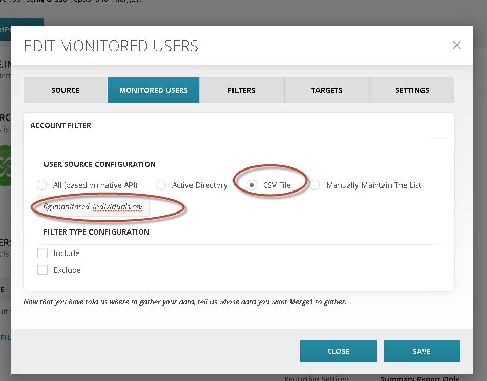
      
   2. If `Monitored User` option is NOT available, configure `Filter` and use `Dynamic` -\> `CSV` option to point it to `{FILESHARE_WORKSPACE_ROOT}\DataTransfer\Import\Globanet_Data\{DATA_SOURCE_ARTIFACT_ID}\Drop\Config\monitored_individuals.csv`

      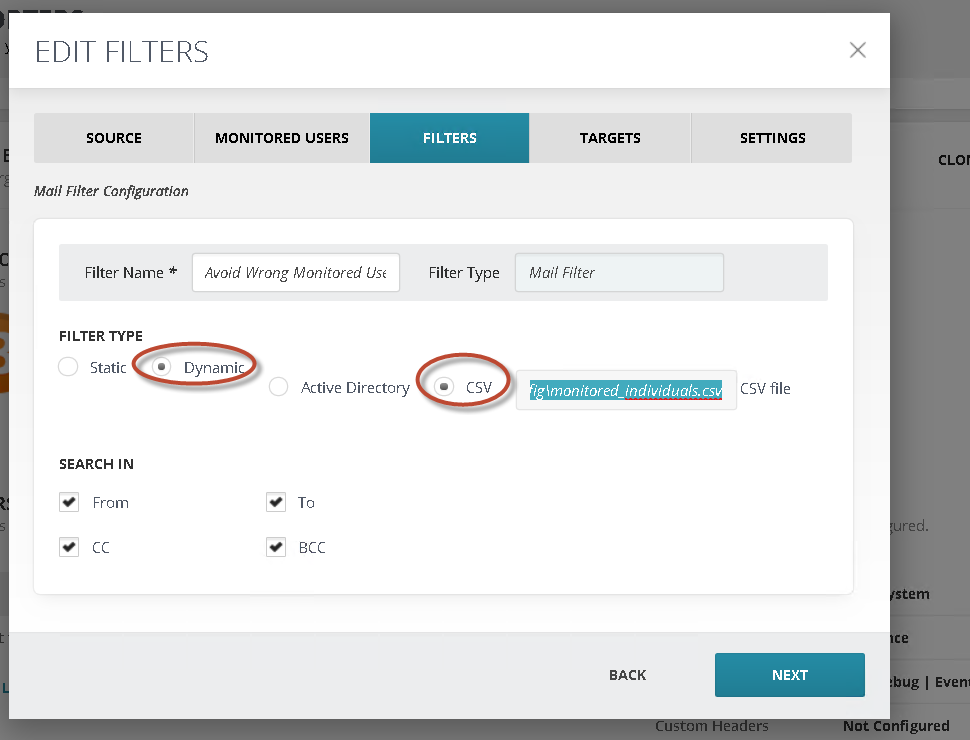

      1. Go to Edit filters
      2. Add new Mail filter
      3. From Filter type select Dynamic option
      4. Select CSV option and type path to CSV file. Please be sure that CSV has no headers and contains only two columns: SMTP address in the first column and the username in the second (example@example.com, username).
      5. Go to importer settings
      6. Under the filtering section check Enable Filtering checkbox
      7. Check Process all filters checkbox
      8. Select Match any option
      9. From the first Target dropdown menu select your default target
      10. From Filter dropdown menu select created Mail filter
      11. From the second Target dropdown menu select the target where your monitored users' messages will be imported
      12. Hit the + button and save settings

   3. Configure Target to point to the appropriate `localDirectoryPath`

   
       
   
       

   4.  Configure `LOG ON ACCOUNT` section
       1.  Best practice is to specify computer administrator's username and password
           
   5.  Configure `REPORTING` section
       1.  Report Level = Generate Summary Report Only
       2.  MISC = Leave Checkbox checked for `Delete reported and ...`
       3.  MUST specify `EMAIL REPORT SETTINGS` and send test email
           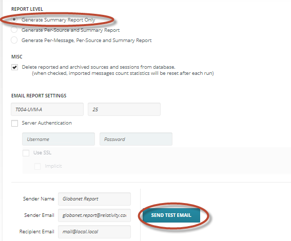
   6.  Configure `LOGGING` section
       1.  File log folder = `{FILESHARE_WORKSPACE_ROOT}\DataTransfer\Import\Globanet_Data\{DATA_SOURCE_ARTIFACT_ID}\Logs`
       2.  File Log Priority = `Error`
       3.  Event Log Priority = `Error`
   7.  Configure `ALERTING` section
       1.  MUST configure Email Alert Settings
       2.  Send Test Email
           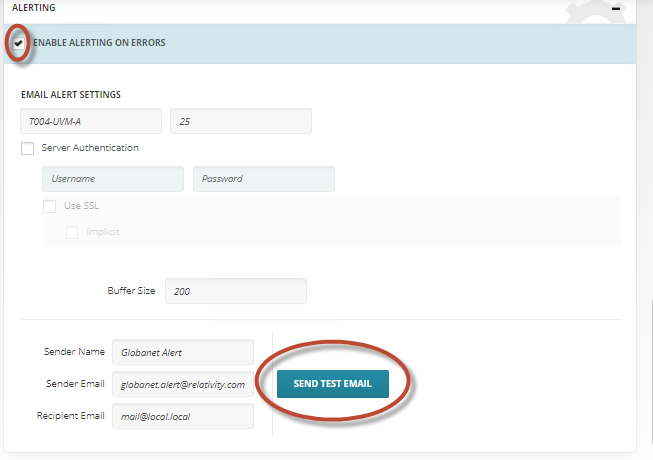
   8.  For data source-specific instructions, Refer to `Merge1 6.0 User Guide.pdf` guide. Reach out to [support@relativity.com](mailto:support@relativity.com) if you don't have access to this guide.
   9.  Configure `Importer Schedule` to run at a desirable frequency (daily is the most common frequency)


   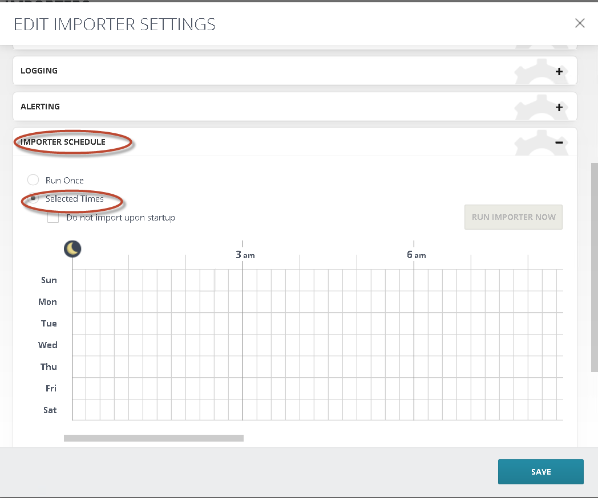


### Appendix A: Bloomberg, ICE Chat, Thomson Reuters, Symphony

All of these Data Sources work similar via scheduled drops of data to an FTP. Merge1 picks it up from SFTP and delivers it to Trace.

See sample data flow below and refer to [Merge 1 User Guide](https://www.veritas.com/content/support/en_US/doc/Merge1_7.0_UserGuide) for more details


*ref: [PlantUML Code](diagrams/trace_shipper_ice_chat_flow.txt)*

Data Pull (1) and Process (2) are performed via Veritas Merge1 software. Audio data is provided by external data provider.
{: .info }

SMB protocol is available only for on-premise deployments with direct access to RelativityFileshare.
{: .info }

### Appendix B: Veritas Merge1 Importer Schedule Helper

In order to ensure that data source runs **every X minutes** run the following steps OR manually select appropriate time slots:

1.  Open chrome and navigate to Configuration

    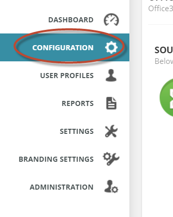

2.  Edit Importer Settings

    

    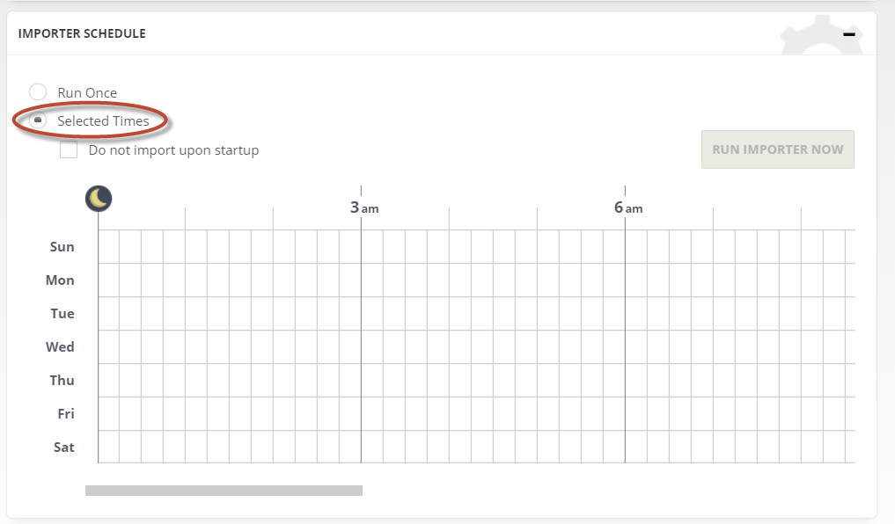

    

    1. Script needed:  `$("div.schedule_table").find("td").click()`
    2. 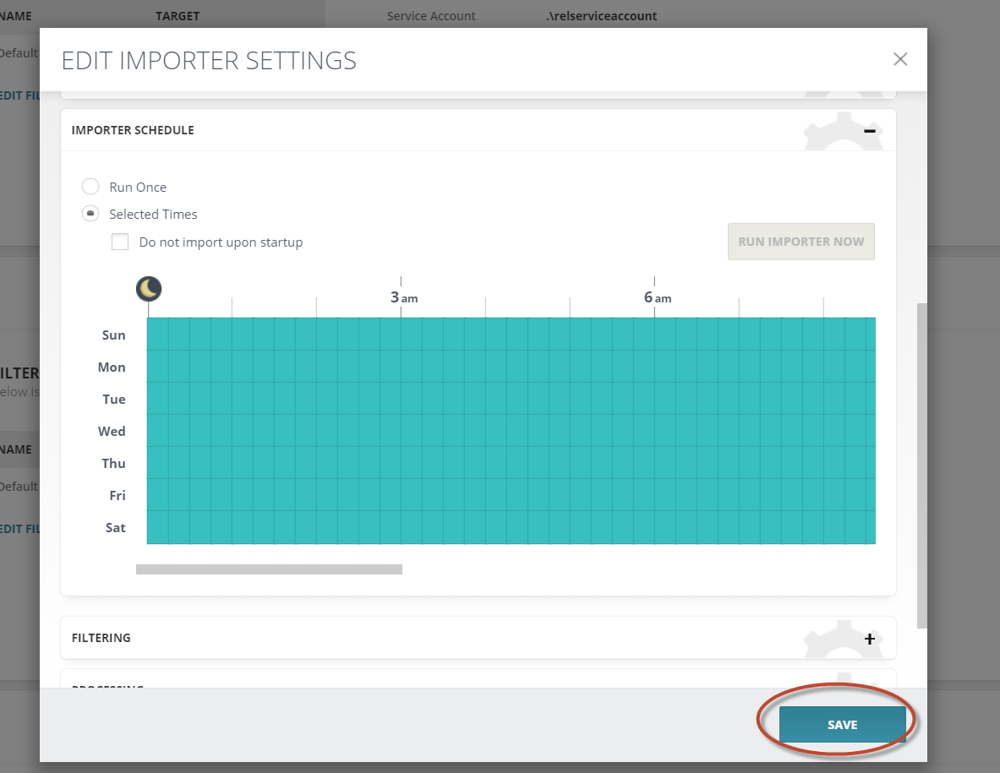
    3. At this point Importer will be set to run every x minutes
    
### Appendix C: High Availability Setup for Veritas Merge1

It is possible to setup Merge1 in HA mode. The recommended approach is to setup secondary Merge1 server that runs the same version of the Merge1 and installed in the same path as the production. You also need to have the same folder structure for all connectors (Import, quarantine, log folders). 

Once that is done, the secondary Merge1 should be connected to the same Merge1 DB as the primary Merge1 server. If for any reason the production server goes down, you just need to run the services on the second Merge1. Please note that no service should be started on the secondary Merge1 if the production is running. 
For the DB, you can take backups on a daily basis or apply any other standard SQL Server  HA scenarios that you wish.

### Appendix D: Sync of Config Folder

All Data Sources in Relativity Trace serialize their current state as a JSON file at regular intervals. They also save a CSV file of all the linked monitored individuals as well. These files are saved in a Config folder in the Source or Drop folder for each data source. Trace Shipper can be configured to retrieve these Config folders, which allows for a way to sync data sources and monitored individuals from local to remote instance.
