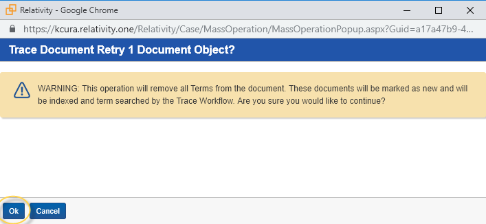

# Resolving Data Flow Issues
{: .no_toc }

Although the Trace team is monitoring data flows to ensure all documents are progressing through status there are rare times when manual intervention is necesssary.
{: .fs-6 .fw-300 }

1. TOC
{:toc}

---

## Document Retry and Error Resolution

If you wish to re-submit existing documents through the Trace Data Flow, you can accomplish this via Document mass operation `Trace Document Retry`. The mass operation resets the following fields: `Trace Checkout`, `Trace Terms`, `Trace Rule Terms`, `Trace Rules`, `Trace Alerted On`, `Trace Omit from Alert Rules`, `Trace Workflow Rules`, and sets `Trace Document Status` to `1 - New` and updates `Trace Document Status Updated On` for all selected documents and their family members. Simply check the documents that you wish to retry from the Document List and click the item in the dropdown and click `Ok` on the pop-up. If your browser settings prevent pop-ups please enable them for Relativity URLs.

> **NOTE:** Trace Document Retry will not move documents between Folders, remove Analytics or Script results, or remove review decisions. These steps should be taken manually prior to performing Trace Document Retry if necessary for workflows.

> **NOTE:** Trace Document Retry does not re-extract metadata from the document natives. Existing data is used to re-index, and re-run term searching and rule evaluation using the current term and rule sets.

> **NOTE:** Trace Document Retry will only work when the "Run Option" on the Setup tab is set to `Continuous`

>  **WARNING:** The retry process can be very resource-intensive. Trace is optimized for ongoing and forward-looking use cases where documents are only searched once upon ingestion. Triggering a retry will treat affected documents as if they were brand new to Trace, clearing all previous Rule and Term associations. If enough documents are retried at once, the system could struggle to handle the sudden influx of documents. Please exercise caution when using this feature.

