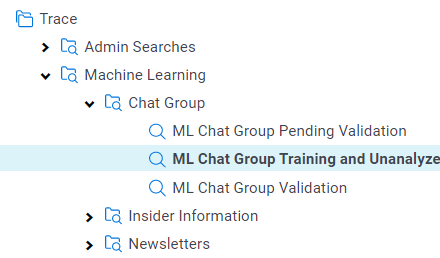
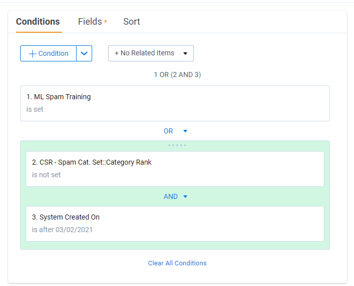
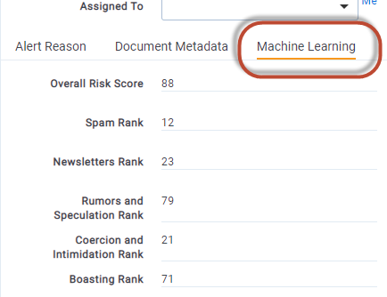
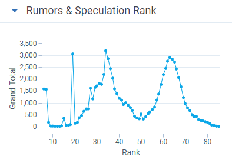
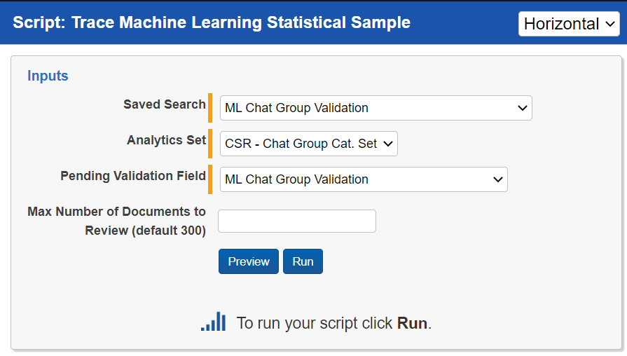
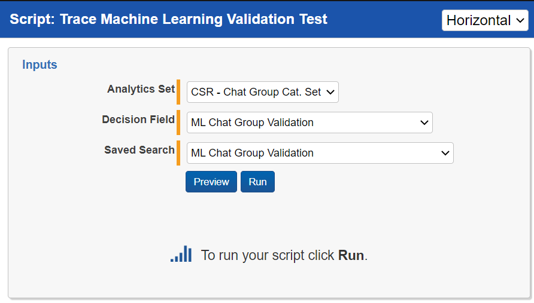
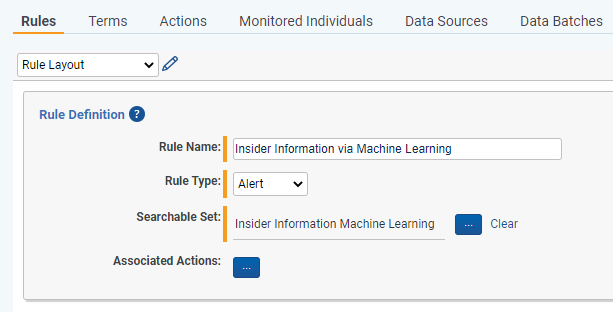
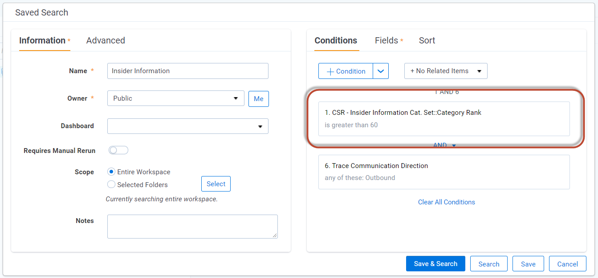

# Machine Learning
{: .no_toc }

Description here...
{: .fs-6 .fw-300 }

1. TOC
{:toc}

---

### Machine Learning

Machine Learning models can help identify risk, categorize documents to create more tailored Rules, or identify irrelevant content that shouldn't be alerted on to reduce false-positive alerting. Trace Machine Learning models are binary classifiers, meaning each model Ranks a document between 0-100 on the likelihood of it being a positive example of the type of content that the model is attempting to identify. E.g. a Spam model would Rank a document it's confident is spam as 95 and a document it believes is not spam as 15. Because our models are binary classifiers, you will create a different model for each behavior you are looking to identify. You can have multiple Machine Learning models implemented within your workspace.

Relativity Trace comes with an expanding set of **Pre-Built Machine Learning Models** and the **Policy Enhancement Process** to effectively implement these models within your organization. To learn more about the Trace Pre-Built Machine Learning Models reach out to support@relativity.com.

> **IMPORTANT:** Each Machine Learning model should be as specific as possible. Creating a model to identify "Risk" overall will not be very accurate, because "Risk" can be hundreds of different things. Rather you'd want to create one Machine Learning model for "Sharing of Insider Information", another for "Change of Venue", and another for "Sexual Harassment". Each of these models will be more accurate because they are looking for one behavior rather than many.
>
> **Examples of common models:**
>
> 1. Remove Irrelevant Content (Spam, Newsletter, Research Reports, etc.)
> 2. Classify Communication Types (Trade Related Communications, Sales conversations, etc.)
> 3. Risk Identification (Insider Information, Boasting, Rumors, etc.)

#### Setting up a Machine Learning Model

Follow these steps to build a machine learning model:

1. Create the following Document fields
   1. A field to code documents that should act as Training document to build the model
      1. Name = "ML [Model Purpose] Training" (eg. `ML Spam Training`)
         1. Field Type = Single Choice
            1. Add Choices
               1. "Positive [Model Purpose]" (eg. `Positive Spam`)
               2. "Negative [Model Purpose]" (eg. `Negative Spam`)
   2. A field to confirm or deny model predictions, for running a Validation Test to understand the accuracy of the model
      1. Name = "ML [Model Purpose] Validation" (eg. `ML Spam Validation)
         1. Field Type = Yes/No
         2. 'Yes' Display Value = "Positive"
         3. 'No' Display Value = "Negative"
   3. A field to mark documents that need to be manually reviewed prior to running a Validation Test
      1. Name = "ML [Model Purpose] Pending Validation" (eg. `ML Spam Pending Validation)
         1. Field Type = Yes/No
2. Create the following Saved Searches
   1. A Saved Search that includes your Training documents along with documents that don't have Machine Learning results for your Classification Index
      1. Name = "ML [Model Purpose] Training and Unanalyzed" (eg. `ML Spam Training and Unanalyzed`)
         1. Conditions
            1. "ML [Model Purpose] Training" field IS SET. (eg. `ML Spam Training` IS SET)
         2. Fields = `Extracted Text` **ONLY**
   2. A Saved Search that includes a strategic sample of ranked documents that need to be reviewed before running a Validation Test
      1. Name = "ML [Model Purpose] Pending Validation" (eg. `ML Spam Pending Validation`)
         1. Conditions
            1. "ML [Model Purpose] Pending Validation" field IS "Yes". (eg. `ML Spam Training` IS "Yes")
   3. A Saved Search that includes documents that have been review in preparation for running a Validation Test
      1. Name = "ML [Model Purpose] Validation" (eg. `ML Spam Validation`)
         1. Conditions
            1. "ML [Model Purpose] Validation" field IS SET. (eg. `ML Spam Validation` IS SET)
         2. Fields
            1. Control Number
            2. "ML [Model Purpose] Validation" field
   4. Organize these Saved Searches within folders for easier navigation as you will be revisiting them periodically.

3. Create the following Document Layouts
   1. Create a layout that will allow for you to code documents on your newly created fields
      1. Name = "Machine Learning"
         1. Add a Category on your layout for fields related to this model
            1. Add the following fields to the category (make sure all fields are editable)
               1. "ML [Model Purpose] Training" (eg. `ML Spam Training`)
               2. "ML [Model Purpose] Pending Validation" (eg. `ML Spam Pending Validation`)
               3. "ML [Model Purpose] Validation" (eg. `ML Spam Validation`)
            2. Adjust all fields on your layout to display as "Radio Buttons"
4. Identify 5 documents that are Positive examples of what you want your model to identify (eg. 5 Spam documents)
   1. Code those documents as positive on the "ML [Model Purpose] Training" field (eg. `Positive Spam` on the `ML Spam Training` field)
5. Identify 5 documents that are Negative examples of what you don't want your model to identify (eg. 5 NOT Spam documents)
   1. Code those documents as negative on the "ML [Model Purpose] Training" field (eg. `Negative Spam` on the `ML Spam Training` field)
6. Create an Analytics Index
   1. Navigate to the Analytics Indexes tab and press the "New Analytics Index" button
   2. Name = "Trace [Model Purpose] Classification Index" (eg. `Trace Spam Classification Index`)
   3. Index Type = Classification
   4. Searchable Set = "ML [Model Purpose] Training and Unanalyzed" (eg. `ML Spam Training and Unanalyzed`)
7. Navigate to the Analytics Index you just created and select the "Populate Index:Full" button on the console
8. Once the Analytics Index is completed building create an Active Learning Project
   1. Navigate to the Active Learning Project tab (if you can't find the tab the Active Learning application may not yet be installed in your workspace)
   2. Select "New Active Learning Project"
      1. Project Name = "ML [Model Purpose]" (eg. `ML Spam`)
      2. Analytics Index (Classification) = "Trace [Model Purpose] Classification Index" (eg. `Trace Spam Classification Index`)
      3. Review Field = "ML [Model Purpose] Training" (eg. `ML Spam Training`)
      4. Suppress Duplicate Documents = NO
      5. Reviewer Group = *This field doesn't matter for our workflow so select any reviewer group*
9. Once in the Active Learning project we will calculate Machine Learning Ranks on documents for the first time
   1. Check to make sure you 5 documents marked as "Coded ML [Model Purpose]" and 5 documents marked as "Coded Not ML [Model Purpose]" on the Active Learning dashboard
   2. Select the "Update Ranks" button in the upper right corner of the Active Learning dashboard 
   3. Add a "ML [Model Purpose] Cutoff" value of `70` *(This value doesn't actually matter as we will be deciding the Rank Cutoff within the Trace workflow)*
   4. Select the "Update Ranks" button
10. Remove the Active Learning Document View that gets created automatically for active Active Learning Projects
    1. Navigate to the "Views" tab
    2. Search for a View with the same name as your Active Learning Project (eg. `ML Spam`)
    3. Edit the View by changing toggling off the "Visible in Dropdown" field under the Other tab
11. Update your "ML [Model Purpose] Training and Unanalyzed" Saved Search to include unanalyzed documents after a certain date (eg. `ML Spam Training and Unanalyzed`)
    1. Add the conditions in a logic group <u>with an **OR** operator</u>
       1. Machine Learning model rank field IS NOT SET (eg. `CSR - Spam Cat. Set::Category Rank` IS NOT SET)
          1. OR
       2. System Created On IS AFTER [T-7] (eg. `System Created On` IS AFTER 03/02/2021)
          1. This will limit the number of documents analyzed that are a week old or newer
       3. 
12. Configure Trace to automatically run Active Learning (if this has not already been enabled)
    1. Navigate to the "Indexing" Task within the Setup tab.
    2.  Edit the "Global Analytics Build Frequency in Minutes" field to have a value of `120`
       1. This means your Machine Learning model will analyze new document every two hours

> **WARNING:** You want to protect these training documents. Set up a workflow rule to move these into a Machine Learning folder, and ensure your Data Disposal does not touch anything in this folder.

#### Viewing Results

Your Machine Learning Model ranks a document between 0-100 on the likelihood of it being a positive example of the type of content that the model is attempting to identify. This result can be found your Machine Learning model rank field (eg. `CSR - Spam Cat. Set::Category Rank`, `CSR - Insider Information Cat. Set::Category Rank`).

1. Add your Rank field to your Review coding layout

1. Add your Rank field to your Document View
2. Create dashboard showing the ranks across documents
   1. Click the "Add Widget" button on the document Tab and select Pivot
   2. Group By = Machine Learning Model rank field (eg. `CSR - Spam Cat. Set::Category Rank`)
   3. Sort On = Machine Learning Model rank field [ASC]
   4. Default Display Type = Line Chart

#### Validating Model Accuracy

Before using Machine Learning results to make review or alert decisions, you want to be confident that the model is accurately classifying communications based on its purpose. This requires a validation test, which should be run periodically (quarterly) to understand the accuracy and recorded each time for defensibility.

##### Running a Validation Test

To run a Validation Test, we first need to identify a subset of analyzed documents to manually review for accuracy. We have a Relativity Script that tags these documents for review.

1. Run the `Trace Machine Learning Statistical Sample` Relativity Script
   1. Create a Saved Search called "ML [Model Purpose] Validation Test Population" (eg. `ML Spam Validation Test Population`) that includes all documents analyzed between the last time you ran a validation test and today
   2. Navigate to the `Scripts` tab
   3. Find the `Trace Machine Learning Statistical Sample` Relativity Script
   4. Select `Run` within the view
   5. For the `Saved Search` select the "ML [Model Purpose] Validation Test Population" (eg. `ML Spam Validation Test Population`) saved search
   6. For the `Analytics Set` select the Active Learning Project set associated with the model you are looking to validate
   7. For the  `Pending Validation Field` select the appropriate "ML [Model Purpose] Pending Validation" (eg. `ML Spam Pending Validation`)
   8. For the `Max Number of Documents to Review (default 300)` field keep the default, or populate it with a higher number if you want greater confidence in the Precision and Recall metrics
   9. Press the `Run` within the pop up

2. Review each document tagged by the `Trace Machine Learning Statistical Sample` for whether they are positive or negative examples of the behavior your model is attempting to identify
   1. Navigate to the "ML [Model Purpose] Validation Test Population" (eg. `ML Spam Validation Test Population`)
   2. Add a Search Condition to filter to only show documents where the "ML [Model Purpose] Pending Validation" (eg. `ML Spam Pending Validation`) field is set to `YES`
   3. Review each document for whether it is a Positive or Negative example of the behaviors in the model on the "ML [Model Purpose] Validation" (eg. `ML Spam Validation`) field
3. Run the `Trace Machine Learning Validation Test` Relativity Script
   1. Navigate to the `Scripts` tab
   2. Find the `Trace Machine Learning Validation Test` Relativity Script
   3. Select `Run` within the view
   4. For `Analytics Set` select the Active Learning Project set associated with the model you are looking to validate
   5. For `Decision Field` select the Yes/No "ML [Model Purpose] Validation" (eg. `ML Spam Validation`) field that you reviewed documents on associated with the model you are validating
   6. For `Saved Search` select the "ML [Model Purpose] Validation" (eg. `ML Spam Validation`) Saved Search associated with the model you are validating
   7. Press the `Run` within the pop up

##### Interpreting Validation Test Results

The `Trace Machine Learning Validation Test` calculates Precision and Recall across all Rank Cutoff values allowing for you to understand the Machine Learning model's accuracy at different implementation ranks.

###### What is Precision and Recall and Rank Cutoffs?

To explain Precision and Recall, you first need to understand the four different types of document categorizations.

| Document Type  | Description                                                  |
| -------------- | ------------------------------------------------------------ |
| True Positive  | A True Positive is a document that the model believes IS an example of what you are attempting to identify, and the model is CORRECT that it is a Positive example. |
| True Negative  | A True Negative is a document that the model believes IS NOT an example of what you are attempting to identify, and the model is CORRECT that it is a Negative example. |
| False Positive | A False Positive is a document that the model believes IS an example of what you are attempting to identify, and the model is WRONG as the document is actually a Negative example. |
| False Negative | A False Negative is a document that the model believes IS NOT an example of what you are attempting to identify, and the model is WRONG as the document is actually a Positive example. |

Here is a matrix that helps explain the possible document categorizations:

|                                 | Is Actually POSITIVE | Is Actually NEGATIVE |
| ------------------------------- | -------------------- | -------------------- |
| **Model Predicted as POSITIVE** | `True Positive`      | `False Positive`     |
| **Model Predicted as NEGATIVE** | `False Negative`     | `True Negative`      |

**Precision**

Precision is a statistical representation of how right your model is at predicting a document was a Positive example. A value of 100 (1.0) means that the model was right 100% of the time when it marked a document as Positive.

> **Calculation:** Precision = `True Positive` / (`True Positive`+`False Positive`)
>
> **Example:** 0.90 (aka. 90) = 90/(90+10)
>
> **Explanation:** This means that your model is right 90% of the time when it believes a document is Positive

**Recall**

Recall is a statistical representation of how often your model misses Positive examples by thinking they are Negative. A value of 100 (1.0) means that the model was right 100% of the time when it marked a document as Negative.

>  **Calculation:** Recall = `True Positive` / (`True Positive`+`False Negative`)
>
> **Example:** 0.75 (aka. 75) = 90/(90+30)
>
> **Explanation:** This means that your model is right 90% of the time when it believes a document is Positive

**Rank Cutoff**

Rank Cutoff is the rank used by the model to classify a document as either Positive or Negative. With a model ranking every document between 0 and 100 it could specify 90 as the rank cutoff where documents with a Rank equal to or above 90 are Positive and a Rank below 90 is Negative. Or a model could specify 70 as the rank cutoff where documents with a Rank equal to or above 70 are Positive and a Rank below 70 is Negative. Adjusting the rank cutoff  allows for you to hone the model for it's specific use case.

> **Example:** 
>
> 1. If I'm creating a Spam model, I need to be almost 100% sure that the documents the model is identifying as Spam are actually Spam because I will remove these document from Alerting. This means I need my model to have extremely **high Precision** (98-100). In this scenario, I would set my Rank Cutoff to be extremely high (>80) so that my Precision is extremely high. By adjusting the system for high Precision, my Recall will drop. This means that there are many Spam documents in what the model thinks is not Spam. These Spam documents will still be alerted on and will show up to a reviewer as a false-positive alert. This is okay though, because we are erroring on the side of not removing content that could contain misconduct.
> 2. If I'm creating an Insider Information model, I want to make sure I'm casting a wide net and alerting on anything that could possibly be this type of misconduct. This means I need my model to have extremely **high Recall** (90-100). In this scenario, I would set my Rank Cutoff to be low (60-80) so that my Recall is extremely high. By adjusting the system for high Recall, my Precision will drop. This means that there are many non-Insider Information documents in what the model thinks is Insider Information. These non-Insider Information documents will be alerted on and will show up to a reviewer as a false-positive alert. This is okay though, because it ensures we don't miss any type of misconduct.

#### Using the Results from a Machine Learning Model

##### Using Results to Advise Reviewers (<u>Less Confident</u> in Accuracy)

If your Validation Test is not returning the Accuracy needed based on your organizations risk appetite or if you are uncomfortable with Machine Learning in general, this approach has little risk.  In this approach you're displaying your Machine Learning results on the Review coding pane so reviewers can use the results to make more informed decisions. If a Spam model give the reviewers document a high Rank, the review can see that and spend less time reviewing that document.

1. Navigate to Document Layout that you would like to adjust and select `Build Layout`
2. Add a `Machine Learning` Category to your layout where you can park all result fields
3. Add your Machine Learning model rank field (eg. `CSR - Spam Cat. Set::Category Rank`)
4. Rename the field in the layout to be something easier for your reviewer to understand (eg. Spam Rank)

##### Using Results to Generate New Alerts (<u>Confident</u> in Accuracy)

In this approach you're alerting on documents that you Machine Learning results believe could contain risk. This approach will catch document that don't hit on standard lexicons.

1. Create a new saved search for the misconduct you are attempting to catch (eg. Insider Information Machine Learning)

   1. Set the Saved Search conditions as where Machine Learning model rank is greater than *X* (eg. `CSR - Insider Information Cat. Set::Category Rank` > `80`)
      1. Select the appropriate Rank Cutoff based on your Validation Test

2. Navigate to Rules and create a new Alert Rule (eg. Insider Information via Machine Learning)

   1. Link the saved search created in Step 1 to this rule
   2. Don't add any terms or any other criteria to the rule

3. Complete the Steps in the "Using Results to Advise Reviewers" section above to ensure a reviewer can see the Machine Learning results for the model while reviewing the document.

   

> **NOTE:** If you are using Machine Learning results within Rule conditions, you want to make sure that your Machine Learning model has completed analyzing a document before the Rule begins to analyze it. You can set Rules to wait for a document to have Machine Learning results by updating the Saved Search for the `Normalized` setting within the `Rule Evaluation` Task.

##### Using Results to Remove Irrelevant Content (<u>Very Confident</u> in Accuracy)

Once you are very confident in your Machine Learning models that identify irrelevant content, you are ready to use those results to actually remove those documents from being analyzed for alerts.

1. Locate the Saved Search used for the `Omit from Alert Rules` functionality within the `Rules Evaluation` Task (See Trace Document Flow Overview section for more information)
2. Update the Saved Search with "AND Machine Learning model rank is greater than *X*" (eg. AND `CSR - Spam Cat. Set::Category Rank` > `80`)
   1. Select the appropriate Rank Cutoff based on your Validation Test

##### Using Results to Create More Targeted Alerts (<u>Extremely Confident</u> in Accuracy)

Once you are extremely confident in your Machine Learning models, you are ready to use those results to narrow the documents that can hit on specific alerts.

1. Locate the Saved Search for your existing Metadata and Lexicon based rule that relates to the model that you created. (eg. Insider Information Rule)
2. Update the Saved Search with "AND Machine Learning model rank is greater than *X*" (eg. AND `CSR - Insider Information Cat. Set::Category Rank` > `60`)
   1. Start with a lower conservative Cutoff Rank within the Saved Search to be more inclusive. Over time you can raise the Cutoff Rank based on Validation Tests and the desire to further reduce false positive alerts.

**NOTE:** If you are using Machine Learning results within Rule conditions, you want to make sure that your Machine Learning model has completed analyzing a document before the Rule begins to analyze it. You can set Rules to wait for a document to have Machine Learning results by updating the Saved Search for the `Normalized` setting within the `Rule Evaluation` Task.

#### Improving Model Accuracy

##### Relativity Trace Pre-Built Machine Learning Models

Relativity has multiple pre-built machine learning models that can jump start training and allow for you to get results directly after implementation. To utilize these pre-built machine learning models please reach out to support@relativity.com.

##### Using Historic Data

Historic data that has already been coded for the behaviors you are attempting to identify should be added to your models. 

1. Locate the positive or negative examples
2. Use the Edit Mass Operation and the Machine Learning Document Layout to code the documents on the appropriate "ML [Model Purpose] Training"  field
3. Once coded, these documents will automatically be pulled into the associated model as training documents

##### Learning from Reviewer Decisions

Reviewers can code documents for specific behaviors while they are reviewing alerts.

1. Create a new document field where reviewers can make decisions for machine learning models
   1. Name = `Machine Learning Decision`
      1. Field Type = Single Choice
         1. Add Choices
            1. [Model Purpose] (eg. `Spam`)
            2. [Model Purpose] (eg. `Newsletter`)
            3. [Model Purpose] (eg. `Collusion`)
2. During a model training period an Administrator can locate these positive example documents and code them on the "ML [Model Purpose] Training" field so they are automatically pulled into the associated model as training documents

> **NOTE:** Do not let reviewers code directly on the "ML [Model Purpose] Training" field. This will be more challenging for reviewers, cause excess documents to be added to each model, and reduce control Administrators have over the models structure, ultimately garnering poor results.

> **NOTE:** If your training sets exceeds 10,000 documents please reach out to support@relativity.com for optimization steps.