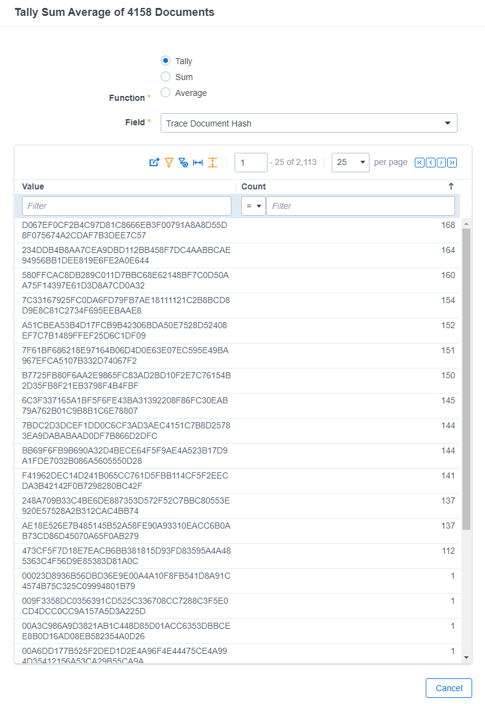

# Excluded Files
{: .no_toc }

Excluded Files lets users exclude specific Extracted files from being ingestion into Trace to remove excess noise and bloat in the system. 
{: .fs-6 .fw-300 }

1. TOC
{:toc}

---

## Excluded Files

The most common type of Extracted file that should be excluded are company logos or communication icons (Twitter, Facebook, etc.) that are often included in many email signatures.

To use this feature, an Excluded File RDO has to be created for each individual file that you want to exclude. This can be accomplished by identifying the documents in the system that you no longer want to be ingested and use the  `Trace Add To Excluded Files` mass operation to add them as Excluded Files. Once added as `Excluded Files`, copies of that file (Trace Document Hash) will no longer be ingested after being extracted from a Native file.

The `Excluded File` RDOs are identified by their Trace Document Hash and have a field for the File itself. 

Once added as an `Excluded File`, copies of that file (same Trace Document Hash) will no longer be ingested after being extracted from a Native file. When an Excluded File is not ingested, the `Trace Excluded Files` multiple object Document field on the parent document (Native) is linked to the Excluded File RDO, letting the user know that an extracted file was not ingested because it was on the Excluded File list.

Only extracted documents (Trace is Extracted = YES) can be used for excluding files from ingestion. However, selecting a native file will still let you perform the mass operation without excluding it.
{: .info }

Excluded File RDO cannot be created from this tab. All Excluded Files have to be created from the Documents tab via the Trace Add To Excluded Files mass operation.
{: .info }

There is a 10,000 file limit to the Excluded Files list. Trying to exceed this limit using the `Trace Add To Excluded Files` mass operation will result in an error. If you wish to increase this size limit, please contact support at [support@relativity.com](mailto:support@relativity.com).
{: .info }

### Trace Add To Excluded Files

`Trace Add To Excluded Files` mass operation can be used to select all the Extracted documents that a user wants to exclude from future ingestion. It works on documents and can be selected in the Documents tab. 

Once the mass operation has completed successfully:

1. The newly Excluded Files will appear in the Excluded Files list within the Excluded Files tab.
2. The documents included in the mass operation and any document in the workspace that has the same Trace Document Hash as a selected document will have the `Trace Is Excluded File` field marked as `Yes`, making it easy to queue up these documents for disposal.

Native files that are selected for the `Trace Add to Excluded Files` mass operation will NOT be added as `Excluded Files`, since the action only includes on Extracted Files.
{: .info }

Deleting an Excluded File only removes the RDO which will allow a user to ingest that document again in future ingestion, but all the documents in the workspace that had their Trace Is Excluded File field marked as True when it was first created because it matched its hash value, will still be marked as True.
{: .info }

### Identifying Files to Exclude

Filter your document list to only show Extracted Files using the `Trace Is Extracted` field. Use the `Tally/Sum/Average` mass operation to identify documents that have many copies within the workspace. Select the "Tally" option within the mass operation and then select the `Trace Document Hash` field to tally on. Sort the table by Trace Document Hash's that have the most copies in the workspace.

If you are attempting to run `Tally/Sum/Average` on more than one million documents you may want to reduce the volume by using the `Sample` function to increase performance.
{: .info }

Copy the Trace Document Hash values with many hits. Conduct a Document search to find documents with these hashes. Review the documents to ensure they should can be excluded from ingestion going forward.  Use the `Trace Add to Excluded Files` mass operation to add these files to the `Excluded File` list.

###  Disposing of Documents that have been Added as Excluded Files

When a document is added to the `Excluded Files` list using the `Trace Add to Excluded Files`, the document and any document in the workspace that have the same Trace Document Hash will get the `Trace Is Excluded File` field marked as `Yes`. These files will no longer be ingested into the workspace, but copies that already exist as Documents in the workspace won't automatically be disposed of. To remove these files you will need to set up a new Workflow Rule with Data Disposal Action that removes files where `Trace Is Excluded File` equals `Yes`.
